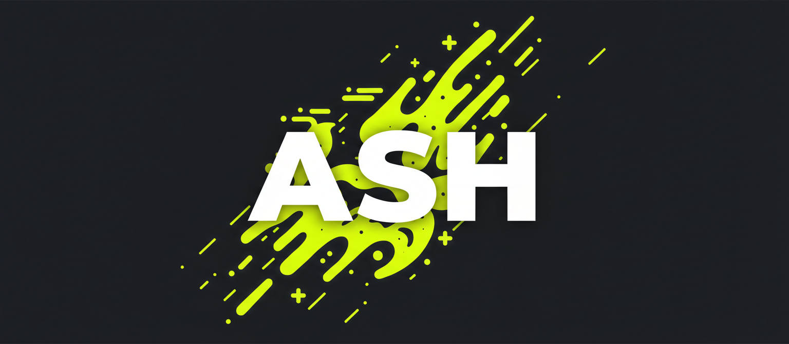

<p align="center">
  
</p>

<h3 align="center">
  Deploy Claude agents as production APIs — with sessions, streaming, sandboxing, and persistence handled for you.
</h3>

<p align="center">
  <a href="https://github.com/ash-ai-org/ash-ai/actions/workflows/ci.yml"></a>
  <a href="https://www.npmjs.com/package/@ash-ai/cli"></a>
  <a href="https://www.npmjs.com/package/@ash-ai/sdk"></a>
  <a href="https://www.npmjs.com/package/@ash-ai/cli"></a>
  <a href="LICENSE"></a>
  <a href="https://github.com/ash-ai-org/ash-ai/stargazers"></a>
</p>

<p align="center">
  <a href="#quick-start">Quick Start</a> &middot;
  <a href="docs/INDEX.md">Docs</a> &middot;
  <a href="#examples">Examples</a> &middot;
  <a href="#architecture">Architecture</a> &middot;
  <a href="CONTRIBUTING.md">Contributing</a>
</p>

---

> **If you find Ash useful, consider giving it a star.** It helps others discover the project.

## The Problem

The Claude Agent SDK handles the AI. But production agents need infrastructure — and without Ash, you're building all of it yourself:

| What you need | Without Ash |
|---|---|
| **Session persistence** | Build session lifecycle, state serialization, crash recovery from scratch |
| **Real-time streaming** | SSE with backpressure, reconnection, typed events, error boundaries |
| **Sandboxed execution** | Process isolation, resource limits, environment allowlists, pool management |
| **Session resume** | Pause/resume across restarts, cold recovery, cross-machine handoff |
| **REST API** | Server, routing, OpenAPI spec, auth, CORS — before your agent does anything useful |
| **Credential management** | API key auth, scoped permissions, secrets storage |

Each of these is a genuinely hard engineering problem. You shouldn't have to solve them to ship an agent.

**Ash handles all of it.** You write an agent folder, Ash gives you a production API.

## Quick Start

```bash
npm install -g @ash-ai/cli
```

```bash
# Set your Anthropic API key
export ANTHROPIC_API_KEY=sk-ant-...

# Start the server
ash start

# Define an agent — it's just a folder
mkdir my-agent
cat > my-agent/CLAUDE.md << 'EOF'
You are a helpful coding assistant. Be concise and accurate.
When asked to write code, include working examples.
EOF

# Deploy and use it
ash deploy ./my-agent --name my-agent
ash session create my-agent
ash session send <SESSION_ID> "Write a prime number checker in Python"
```

```
Your agent folder          What you get back
─────────────────          ─────────────────────────────────────
my-agent/                  POST /api/sessions         → create session
├── CLAUDE.md              POST /api/sessions/:id/messages → stream messages (SSE)
├── .claude/               GET  /api/sessions/:id     → session status
│   ├── settings.json      POST /api/sessions/:id/pause  → pause session
│   └── skills/            POST /api/sessions/:id/resume → resume session
└── .mcp.json              DELETE /api/sessions/:id   → end session
```

## What Goes in an Agent Folder

An agent is a folder. The only required file is `CLAUDE.md`.

```
my-agent/
├── CLAUDE.md                          # System prompt (required)
├── .claude/
│   ├── settings.json                  # Permissions — which tools the agent can use
│   └── skills/
│       └── search-and-summarize/
│           └── SKILL.md               # Reusable skill definitions
└── .mcp.json                          # MCP server connections (web fetch, memory, etc.)
```

**Minimal agent** — one file:

```markdown
# my-agent/CLAUDE.md
You are a customer support agent for Acme Corp.
Be friendly, cite the docs, and escalate billing issues to humans.
```

**Production agent** — skills, MCP tools, scoped permissions. Still just files in a folder:

```
research-agent/
├── CLAUDE.md                          # "You are a research assistant..."
├── .mcp.json                          # Connect to web fetch, memory servers
└── .claude/
    ├── settings.json                  # Allow: Bash, WebSearch, mcp__fetch, mcp__memory
    └── skills/
        ├── search-and-summarize/
        │   └── SKILL.md              # /search-and-summarize skill
        ├── analyze-code/
        │   └── SKILL.md              # /analyze-code skill
        └── write-memo/
            └── SKILL.md              # /write-memo skill
```

## What You Get

| Feature | Description |
|---------|-------------|
| **Session persistence** | Sessions, messages, and sandbox state stored in SQLite or Postgres. Swap with zero code changes. |
| **Real-time streaming** | SSE streaming with typed events — text deltas, tool calls, errors, done signals. Backpressure built in. |
| **Sandbox isolation** | Each session runs in an isolated process. Restricted env, resource limits (cgroups), filesystem isolation (bubblewrap). |
| **Session pause/resume** | Pause a session, resume it minutes or days later — even on a different machine. Workspace state persisted to S3/GCS. |
| **REST API + OpenAPI** | Full API with Swagger UI at `/docs`. Auth, CORS, typed endpoints — production-ready out of the box. |
| **Sandbox pool** | DB-backed pool with capacity limits, LRU eviction, idle sweep. Sandboxes reused across messages. |
| **Multi-runner** | Scale horizontally. Add runner nodes, the coordinator routes sessions to the least-loaded one. |
| **TypeScript + Python SDKs** | First-class clients for both languages. `npm install @ash-ai/sdk` / `pip install ash-ai` |
| **One-command cloud deploy** | Deploy to EC2 or GCE with included scripts. Or run anywhere Docker runs. |

## Using the SDK

```bash
npm install @ash-ai/sdk
```

```typescript
import { AshClient } from '@ash-ai/sdk';

const client = new AshClient({ serverUrl: 'http://localhost:4100' });

const session = await client.createSession('my-agent');

for await (const event of client.sendMessageStream(session.id, 'Hello!')) {
  if (event.type === 'message') {
    process.stdout.write(event.data);
  }
}

await client.endSession(session.id);
```

Python:

```bash
pip install ash-ai
```

```python
from ash_sdk import AshClient

client = AshClient(server_url="http://localhost:4100")
session = client.create_session("my-agent")

for event in client.send_message_stream(session.id, "Hello!"):
    if event.type == "message":
        print(event.data, end="")

client.end_session(session.id)
```

## Architecture

```
CLI / SDK / Browser
        │
        │ HTTP + SSE
        ▼
┌──────────────────┐
│   ash-server     │──── SQLite / Postgres
│   (Fastify)      │
└────────┬─────────┘
         │ in-process
         ▼
┌──────────────────┐
│   SandboxPool    │
└──┬───────────┬───┘
   │           │
   ▼           ▼
┌──────┐   ┌──────┐
│Bridge│   │Bridge│    ← isolated child processes
│  1   │   │  2   │    ← Unix socket, newline-delimited JSON
└──┬───┘   └──┬───┘
   ▼           ▼
Claude SDK  Claude SDK
```

Each bridge runs inside a sandbox with restricted environment variables, resource limits (cgroups on Linux), and filesystem isolation (bubblewrap). The server manages the pool, routes sessions, persists state, and proxies SSE streams to clients.

**Standalone mode**: Server manages sandboxes locally. Zero configuration.

**Coordinator mode**: Server is a pure control plane. Runners register, send heartbeats, and host sandboxes. New sessions route to the least-loaded runner.

See [docs/architecture.md](docs/architecture.md) for the full design.

## Documentation

| Doc | Description |
|-----|-------------|
| [Getting Started](docs/getting-started.md) | Full walkthrough: install, deploy, chat |
| [CLI Reference](docs/cli-reference.md) | All CLI commands and flags |
| [API Reference](docs/api-reference.md) | REST endpoints, SSE format, SDK usage |
| [Architecture](docs/architecture.md) | System design, sandbox isolation, bridge protocol |
| [EC2 Deployment](docs/guides/ec2-deployment.md) | Deploy to AWS |
| [GCE Deployment](docs/guides/gce-deployment.md) | Deploy to GCP |

Full docs index: [docs/INDEX.md](docs/INDEX.md)

## Examples

| Example | Description |
|---------|-------------|
| [qa-bot](examples/qa-bot) | Next.js chat UI that talks to an Ash agent |
| [hosted-agent](examples/hosted-agent) | Research agent with skills, MCP tools, and interactive CLI demo |
| [python-bot](examples/python-bot) | Multi-turn conversation using the Python SDK |

## Star History

<a href="https://star-history.com/#ash-ai-org/ash-ai&Date">
 <picture>
   <source media="(prefers-color-scheme: dark)" srcset="https://api.star-history.com/svg?repos=ash-ai-org/ash-ai&type=Date&theme=dark" />
   <source media="(prefers-color-scheme: light)" srcset="https://api.star-history.com/svg?repos=ash-ai-org/ash-ai&type=Date" />
   
 </picture>
</a>

## Contributing

We welcome contributions! See [CONTRIBUTING.md](CONTRIBUTING.md) for development setup and building from source.

## License

[MIT](LICENSE) — built by the [Ash](https://github.com/ash-ai-org) team and contributors.
