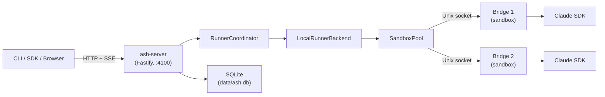
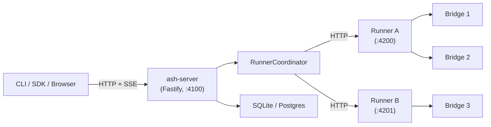
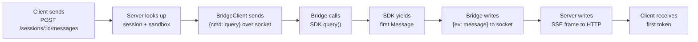
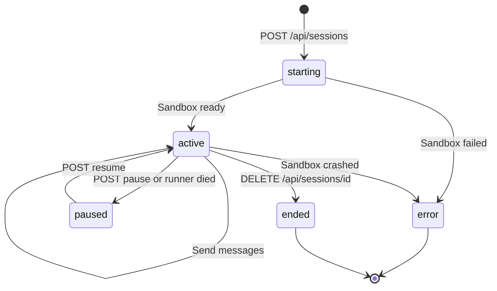
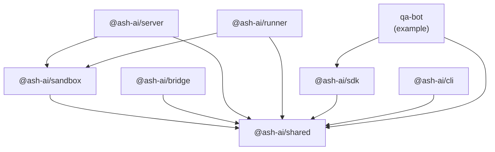

# Architecture

## Overview

Ash is a thin orchestration layer around the [Claude Code SDK](https://github.com/anthropics/claude-code). It manages agent registration, session lifecycle, sandbox isolation, and streaming — the SDK does the actual AI work.

### Standalone Mode (Default)



In standalone mode, the server manages sandboxes locally via an in-process `SandboxPool`. The `RunnerCoordinator` exists but only wraps a single `LocalRunnerBackend`. This is the default — zero configuration needed.

### Coordinator Mode (Multi-Runner)



In coordinator mode (`ASH_MODE=coordinator`), the server is a pure control plane. Runners register via internal endpoints, send heartbeats, and host the sandboxes. The coordinator routes new sessions to the least-loaded runner. See [features/multi-runner.md](./features/multi-runner.md) for details.

## Components

### ash-shared (`@ash-ai/shared`)

Types, protocol encoding, and constants. Zero dependencies. Every other package imports from here.

Key exports:
- Types: `Agent`, `Session`, `AshStreamEvent`, `HealthResponse`, etc.
- Protocol: `encode()` / `decode()` for newline-delimited JSON over Unix sockets
- Constants: ports, timeouts, sandbox limits, env allowlist

### ash-sandbox (`@ash-ai/sandbox`)

Shared library for sandbox lifecycle management. Used by both the server and runner. This is a library, not a standalone process.

Key exports:
- `SandboxManager` — Spawns/destroys bridge child processes, manages Unix socket connections
- `SandboxPool` — DB-backed pool with capacity limits, LRU eviction, and idle sweep
- `BridgeClient` — Unix socket client for communicating with bridge processes
- Resource limits — `spawnWithLimits()`, cgroups on Linux, ulimit on macOS
- State persistence — `persistSessionState()`, `restoreSessionState()` for session resume

### ash-server (`@ash-ai/server`)

Fastify HTTP server. The control plane:

- **REST API** — Agent CRUD, session lifecycle, health check
- **SSE streaming** — Proxies bridge events to HTTP clients as Server-Sent Events
- **SQLite/Postgres** — Persists agents, sessions, sandbox metadata
- **OpenAPI** — Auto-generated spec + Swagger UI at `/docs`
- Uses `@ash-ai/sandbox` for all sandbox operations

### ash-runner (`@ash-ai/runner`)

Lightweight Fastify worker node for the multi-machine split (step 08). Manages sandboxes on a remote host and registers with the central server.

- Runs `SandboxPool` with an in-memory DB (no SQLite needed)
- Exposes sandbox management routes for the server to call
- Self-registers with the server via `ASH_SERVER_URL`
- Uses `@ash-ai/sandbox` for all sandbox operations

### ash-bridge (`@ash-ai/bridge`)

Runs inside each sandbox. One bridge per session.

- Reads `CLAUDE.md` from the agent directory (system prompt)
- Listens on a Unix socket for commands from the server
- Calls the Claude Code SDK and streams messages back
- Isolated environment: only allowlisted env vars, restricted filesystem

### ash-sdk (`@ash-ai/sdk`)

TypeScript client library for interacting with ash-server.

- `AshClient` — methods for every API endpoint
- `parseSSEStream()` — reusable SSE parser that works in Node.js and browsers
- Re-exports all types from ash-shared

### ash-cli (`@ash-ai/cli`)

Command-line tool wrapping the SDK.

- `ash deploy` — register an agent
- `ash agent list|info|delete` — manage agents
- `ash session create|send|list|end` — manage sessions
- `ash start|stop|status|logs` — Docker container lifecycle
- `ash health` — check server status

## Data Flow

### Message Hot Path

The critical path from user input to first token back:



Target overhead (Ash's portion, excluding SDK latency): 1-3ms.

### Session Lifecycle



## Sandbox Isolation

Each session runs in a sandboxed child process with:

| Layer | Linux | macOS (dev) |
|-------|-------|-------------|
| Process limits | cgroups v2 (pids.max) | — (skipped) |
| Memory limits | cgroups v2 (memory.max) | — (skipped) |
| CPU limits | cgroups v2 (cpu.max) | — (skipped) |
| File size limits | cgroups + tmpfs | ulimit -f |
| Environment | Strict allowlist | Strict allowlist |
| Filesystem | bubblewrap (planned) | Restricted cwd |
| Network | Namespace isolation (planned) | Unrestricted |

**Environment allowlist** — only these host env vars reach the sandbox:

```
PATH, NODE_PATH, HOME, LANG, TERM, ANTHROPIC_API_KEY, ASH_DEBUG_TIMING
```

Everything else is blocked. The sandbox also receives injected vars: `ASH_BRIDGE_SOCKET`, `ASH_AGENT_DIR`, `ASH_WORKSPACE_DIR`, `ASH_SANDBOX_ID`, `ASH_SESSION_ID`.

## Bridge Protocol

Server and bridge communicate over a Unix socket using newline-delimited JSON.

**Commands** (server -> bridge):

| Command | Fields | Description |
|---------|--------|-------------|
| `query` | `cmd, prompt, sessionId` | Start a new conversation turn |
| `resume` | `cmd, sessionId` | Resume a previous session |
| `interrupt` | `cmd` | Abort current query |
| `shutdown` | `cmd` | Graceful exit |

**Events** (bridge -> server):

| Event | Fields | Description |
|-------|--------|-------------|
| `ready` | `ev` | Bridge is listening and ready |
| `message` | `ev, data` | SDK Message object (passed through as-is) |
| `error` | `ev, error` | Error string |
| `done` | `ev, sessionId` | Turn complete |

## SSE Stream Format

The server proxies bridge events to HTTP clients as SSE:

```
event: message
data: {"type":"assistant","message":{"content":"Hello!"}}

event: message
data: {"type":"assistant","message":{"content":" How can I help?"}}

event: done
data: {"sessionId":"550e8400-..."}
```

Three event types: `message`, `error`, `done`. Each `data:` line is JSON. The stream closes after `done` or a fatal `error`.

**Backpressure**: If the client stops reading, the server waits up to 30 seconds for the TCP buffer to drain before closing the connection.

## Storage

```
data/
├── ash.db              # SQLite database (WAL mode)
└── sandboxes/
    └── <sandbox-id>/
        └── workspace/  # Sandbox working directory
```

Tables:
- `agents` — name, version, path, timestamps
- `sessions` — id, agent_name, sandbox_id, status, runner_id, timestamps
- `sandboxes` — id, session_id, agent_name, state, workspace_dir, timestamps

## Package Dependency Graph



Build order: `shared` first, then `sandbox`, then everything else in parallel.
