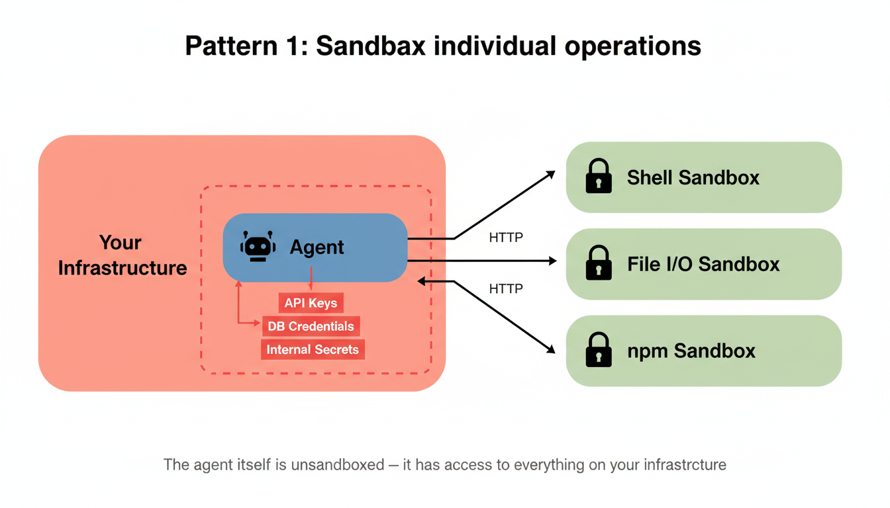
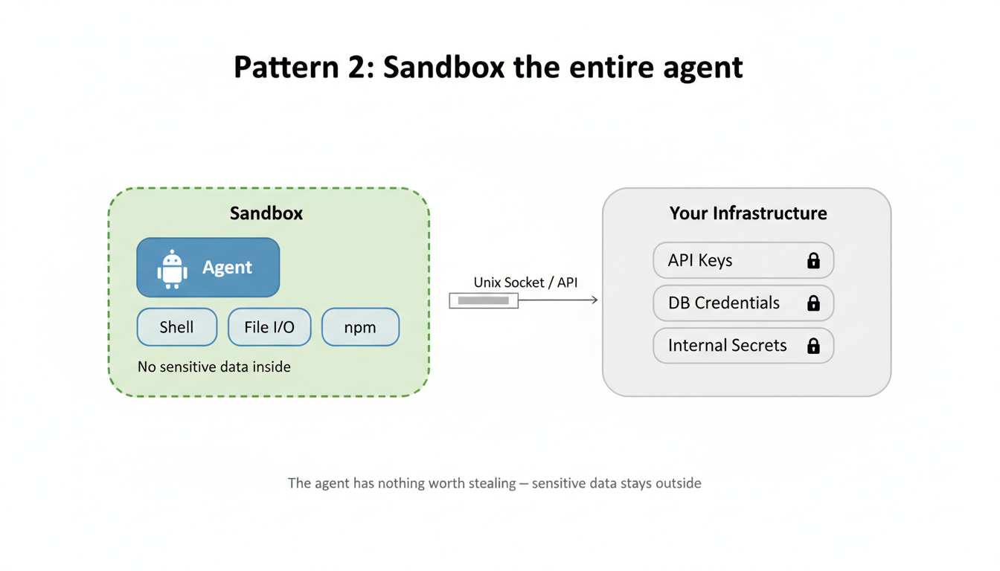

# How We Built Zero-Trust Sandboxes for Claude Code Agents

If you're running AI agents that execute arbitrary code, shell commands, file writes, `npm install`, you need to sandbox them. Not eventually. Now.

This post walks through a production-tested stack for isolating code-executing agents on a single Linux machine: bubblewrap namespaces for filesystem isolation, cgroups v2 for resource limits, privilege dropping, Unix socket IPC, and S3-backed state persistence. No Docker daemon required.

## The problem

More teams are using Claude Code not just for coding, but as a general-purpose agent harness. Data pipelines, research workflows, internal tools. A coding agent with bash, file I/O, and `npm install` turns out to be a pretty good substrate for any task that involves reading, transforming, and producing artifacts. The LangChain-style orchestration framework is giving way to just giving the model a shell and getting out of the way.

Which means more agents executing arbitrary code in production. Each one needs a real environment: bash, node, git, a writable workspace, `/tmp`, a home directory. It runs shell commands, writes files, spawns subprocesses.

Now put multiple tenants on the same machine. Agent A must never see agent B's files, credentials, or processes. And the host must survive misbehaving agents: OOM, fork bombs, runaway disk usage.

Docker is the obvious first answer. But Docker adds ~500ms of startup overhead, needs a daemon, and is awkward to nest (Docker-in-Docker or sibling containers). If your agents are short-lived or you need to spin up dozens on the same host, the overhead adds up fast.

What you actually need is Linux namespaces, the same primitives Docker uses under the hood, without the container runtime.

## The approach: sandbox the entire agent

There are two patterns for sandboxing agents:

**Pattern 1**: The agent runs on your infrastructure, and you sandbox individual dangerous operations (shell exec, file writes) in separate containers. The agent calls into the sandbox over HTTP.



**Pattern 2**: The entire agent runs inside the sandbox. It has nothing worth stealing because it never had access to anything sensitive in the first place.



Pattern 2 is simpler and more secure. You don't need to enumerate which operations are dangerous, everything is contained. The tradeoff is that you need a real development environment inside the sandbox (bash, node, git, a writable workspace) not just a locked-down function executor.

## Layer 1: bubblewrap, filesystem isolation

[bubblewrap](https://github.com/containers/bubblewrap) (`bwrap`) is a lightweight sandboxing tool that uses Linux user namespaces. It's what Flatpak uses under the hood. No daemon, no root required for basic operation, sub-millisecond startup.

The core idea: mount the entire host filesystem read-only, then selectively overlay writable directories for this specific sandbox.

```bash
bwrap \
  --ro-bind / /                          # Host filesystem, read-only
  --tmpfs /tmp                           # Private /tmp per sandbox
  --tmpfs /data                          # Hide ALL tenant data
  --dir /data/sandboxes                  # Recreate parent dir on tmpfs
  --bind /data/sandboxes/abc123 /data/sandboxes/abc123  # THIS sandbox only
  --bind $SANDBOX_DIR/home /home/sandbox # Per-sandbox home directory
  --dev /dev                             # Minimal device nodes
  --proc /proc                           # Process info (isolated by PID namespace)
  --unshare-pid                          # PID namespace, can't see other processes
  --die-with-parent                      # Auto-cleanup when parent exits
  --chdir /data/sandboxes/abc123/workspace \
  -- runuser -u sandbox "$COMMAND"       # Drop to unprivileged user
```

The critical trick is the `--tmpfs /data` overlay. Say `/data` contains `agents/`, `sessions/`, and `sandboxes/` for *all* tenants. The tmpfs hides everything. Then we bind-mount back only this sandbox's own directory.

What the agent sees:
- Its own workspace (read-write)
- Its own `/home/sandbox` (read-write)
- Its own `/tmp` (read-write)
- The host OS read-only: node, bash, git, everything it needs to code
- An empty `/data/` directory with only its own sandbox visible

What it cannot see:
- Other agents' files
- Other sessions' workspaces
- The host `/data/` directory contents
- Other processes (PID namespace)

In code, building the bwrap argument list looks like this:

```typescript
function buildBwrapArgs(opts: {
  sandboxDir: string;
  homeDir: string;
  workspaceDir: string;
  dataDir: string;
  command: string;
  args: string[];
}): string[] {
  const sandboxesDir = path.join(opts.dataDir, 'sandboxes');
  return [
    '--ro-bind', '/', '/',
    '--tmpfs', '/tmp',
    '--tmpfs', opts.dataDir,
    '--dir', sandboxesDir,
    '--bind', opts.sandboxDir, opts.sandboxDir,
    '--bind', opts.homeDir, '/home/sandbox',
    '--dev', '/dev',
    '--proc', '/proc',
    '--unshare-pid',
    '--die-with-parent',
    '--chdir', opts.workspaceDir,
    '--', 'runuser', '-u', 'sandbox',
    opts.command, ...opts.args,
  ];
}
```

No Docker daemon. No image pulls. The sandbox starts in under 100ms.

## Layer 2: cgroups v2, resource limits

Filesystem isolation prevents agents from seeing each other, but a rogue agent can still starve the host by allocating all memory or fork-bombing. You need resource limits.

cgroups v2 gives you per-sandbox memory, CPU, and process count limits. First, set up delegation in your entrypoint (before any sandboxes start):

```bash
#!/bin/bash
# docker-entrypoint.sh, runs once at container start

if [ -d /sys/fs/cgroup ] && [ -w /sys/fs/cgroup ]; then
  # Move existing processes to a leaf cgroup (required before enabling controllers)
  mkdir -p /sys/fs/cgroup/server
  for pid in $(cat /sys/fs/cgroup/cgroup.procs 2>/dev/null); do
    echo "$pid" > /sys/fs/cgroup/server/cgroup.procs 2>/dev/null || true
  done

  # Enable controllers on root
  echo "+memory +cpu +pids" > /sys/fs/cgroup/cgroup.subtree_control 2>/dev/null || true

  # Create sandbox parent cgroup
  mkdir -p /sys/fs/cgroup/sandbox
  echo "+memory +cpu +pids" > /sys/fs/cgroup/sandbox/cgroup.subtree_control 2>/dev/null || true
fi
```

Then, when creating each sandbox, write limits to a per-sandbox cgroup:

```typescript
function createCgroup(sandboxId: string, limits: {
  memoryMb: number;
  cpuPercent: number;
  maxProcesses: number;
}): string {
  const cgroupPath = `/sys/fs/cgroup/sandbox/${sandboxId}`;
  fs.mkdirSync(cgroupPath, { recursive: true });

  // Memory: hard cap, no swap
  fs.writeFileSync(`${cgroupPath}/memory.max`, String(limits.memoryMb * 1024 * 1024));
  fs.writeFileSync(`${cgroupPath}/memory.swap.max`, '0');

  // CPU: 100000 period, quota scales with percent (100 = 1 core)
  fs.writeFileSync(`${cgroupPath}/cpu.max`, `${limits.cpuPercent * 1000} 100000`);

  // Process count: fork bomb protection
  fs.writeFileSync(`${cgroupPath}/pids.max`, String(limits.maxProcesses));

  return cgroupPath;
}

// Add the sandbox's PID to its cgroup
function addToCgroup(cgroupPath: string, pid: number): void {
  fs.writeFileSync(`${cgroupPath}/cgroup.procs`, String(pid));
}
```

Sensible defaults for a coding agent:

| Limit | Value | Why |
|-------|-------|-----|
| `memory.max` | 2 GB | Enough for node + npm install, not enough to OOM the host |
| `memory.swap.max` | 0 | No swap, fail fast instead of grinding |
| `cpu.max` | 100000/100000 | 1 full core max |
| `pids.max` | 64 | Fork bomb protection |

For disk, cgroups don't help directly. We run `du -sk` on the workspace every 30 seconds and kill the sandbox if it exceeds 1 GB:

```typescript
function startDiskMonitor(
  workspaceDir: string,
  limitMb: number,
  onExceeded: () => void,
): NodeJS.Timeout {
  return setInterval(() => {
    try {
      const output = execSync(`du -sk '${workspaceDir}'`, { timeout: 5000 })
        .toString().trim();
      const sizeKb = parseInt(output.split('\t')[0], 10);
      if (sizeKb > limitMb * 1024) onExceeded();
    } catch { /* workspace gone, sandbox already dead */ }
  }, 30_000);
}
```

When a sandbox hits a memory limit, the kernel sends SIGKILL. You can detect this from the parent:

```typescript
child.on('exit', (code, signal) => {
  if (signal === 'SIGKILL' || code === 137) {
    console.error(`Sandbox ${id} OOM killed (limit: ${limits.memoryMb}MB)`);
  }
});
```

## Layer 3: privilege drop

The pattern:

1. Container image creates a `sandbox` user (e.g., uid 1100)
2. Server process runs as root (needed for bwrap namespace creation and cgroup writes)
3. Inside bwrap, `runuser -u sandbox` drops to non-root
4. All agent code runs unprivileged

Before spawning the sandbox, chown its directories to the sandbox user:

```typescript
const SANDBOX_UID = 1100;
const SANDBOX_GID = 1100;

// Create per-sandbox home and tmp
mkdirSync(join(sandboxDir, 'home'), { recursive: true });
mkdirSync(join(sandboxDir, 'tmp'), { recursive: true });
execSync(`chown -R ${SANDBOX_UID}:${SANDBOX_GID} '${sandboxDir}'`);
```

The agent can write to its workspace and home, but that's it. The host filesystem is read-only. Even if the agent finds an exploit, it's running as uid 1100 with no capabilities.

## Communication: Unix socket, not HTTP

You could use HTTP to communicate with sandboxes, and that works if the sandbox and server are on different machines.

For same-machine sandboxes, a Unix socket is simpler:

```
Server <-> Unix Socket <-> Bridge (inside sandbox) <-> Agent
```

The socket file lives in the sandbox directory. Because that directory is bind-mounted, both the server (outside) and the bridge process (inside) can see it. No TCP stack, no port management, no firewall rules.

The protocol is newline-delimited JSON, about as simple as IPC gets:

```typescript
// Encode
function encode(msg: Command | Event): string {
  return JSON.stringify(msg) + '\n';
}

// Decode
function decode(line: string): Command | Event {
  return JSON.parse(line.trim());
}
```

Commands flow server-to-sandbox: `query`, `resume`, `interrupt`, `shutdown`, `exec`. Events flow back: `ready`, `message`, `done`, `error`, `log`.

The readiness protocol is worth calling out. Instead of polling the socket file, the bridge writes a single `'R'` byte to stdout when it's listening. The server waits for this byte. Zero wasted time, no race conditions.

```typescript
// Server side: wait for bridge readiness
await new Promise<void>((resolve, reject) => {
  const onData = (chunk: Buffer) => {
    if (chunk[0] === 0x52) { // 'R'
      child.stdout.removeListener('data', onData);
      resolve();
    }
  };
  child.stdout.on('data', onData);
  child.on('exit', () => reject(new Error('Bridge exited before ready')));
});
```

The bridge process itself is roughly 200 lines. It receives commands, passes them to the agent SDK, and streams back events. Nothing clever, that's the point.

## Environment isolation

Every environment variable the agent can see is explicitly allowlisted:

```typescript
const ENV_ALLOWLIST = [
  'PATH', 'NODE_PATH', 'HOME', 'LANG', 'TERM',
  'ANTHROPIC_API_KEY', 'ANTHROPIC_BASE_URL',
];

function buildSandboxEnv(sandboxId: string, socketPath: string, workspaceDir: string) {
  const env: Record<string, string> = {};

  // Only pass allowlisted host vars
  for (const key of ENV_ALLOWLIST) {
    if (process.env[key]) env[key] = process.env[key]!;
  }

  // Inject sandbox-specific vars
  env.ASH_BRIDGE_SOCKET = socketPath;
  env.ASH_WORKSPACE_DIR = workspaceDir;
  env.ASH_SANDBOX_ID = sandboxId;

  return env; // Nothing else. No AWS creds, no DB URLs, no internal secrets.
}
```

## State persistence, surviving redeploys

Sandboxes are ephemeral. When the host container redeploys, `/data` is gone. You need to persist workspace state externally.

The approach: tar the workspace, upload to S3, restore on resume.

```typescript
async function persistWorkspace(sessionId: string, workspaceDir: string): Promise<void> {
  const tarPath = `/tmp/${sessionId}.tar.gz`;
  execSync(`tar czf ${tarPath} -C ${workspaceDir} .`, { timeout: 60_000 });

  await s3.send(new PutObjectCommand({
    Bucket: SNAPSHOT_BUCKET,
    Key: `sessions/${sessionId}/workspace.tar.gz`,
    Body: createReadStream(tarPath),
  }));

  unlinkSync(tarPath);
}

async function restoreWorkspace(sessionId: string, workspaceDir: string): Promise<void> {
  const tarPath = `/tmp/${sessionId}.tar.gz`;

  const resp = await s3.send(new GetObjectCommand({
    Bucket: SNAPSHOT_BUCKET,
    Key: `sessions/${sessionId}/workspace.tar.gz`,
  }));

  await pipeline(resp.Body as Readable, createWriteStream(tarPath));
  execSync(`tar xzf ${tarPath} -C ${workspaceDir}`, { timeout: 60_000 });
  unlinkSync(tarPath);
}
```

Skip `node_modules`, `.git`, `__pycache__`, and other reproducible directories when tarring. They dominate snapshot size and can be regenerated.

## The sandbox pool: why pre-warming is what makes this work

Everything above is useless if sandbox creation adds 60 seconds of latency to the first message. The namespace itself spins up in ~100ms, but agent dependencies need to install. `npm install` alone takes 30-60 seconds. A user sends "hello" and stares at a spinner for a minute. That kills the product.

The pool solves this by front-loading that cost. Sandboxes are created and fully installed *before* any user shows up. When a session starts, it claims one that's already warm.

```
Sandbox lifecycle:

  warming --> warm --> running --> waiting --> running --> ... --> cold
    |           |                      |
    |      (claim for session)    (idle timeout)
    |                                  |
    +----------------------------------+
                                  (S3 persist + kill)
```

The latency difference:

| Path | Time to first response |
|------|----------------------|
| Cold start (no pool) | 30-60s (npm install + bridge startup) |
| Warm claim from pool | <1s (bridge already running, deps installed) |
| Warm resume (session still alive) | ~0s (process never stopped) |

**Pre-warming**: When an agent is deployed, call `pool.warmUp("agent-name", count)` to create sandboxes ahead of time. Dependencies install in the background. When the first session arrives, it claims a warm sandbox instantly. The user never sees the install step.

**Idle sweep**: Every 60 seconds, check for sandboxes that have been in `waiting` state too long. Persist the workspace to S3, kill the process, mark as `cold`. This keeps memory usage bounded on the host.

**Cold resume**: When a session with a cold sandbox gets a new message, download the workspace from S3, create a fresh sandbox, restore state. This is the slow path (10-15s), but it only happens after extended inactivity.

**Warm resume**: If the sandbox process is still alive (session came back before idle timeout), there's nothing to do. The process is still running and the workspace is intact. This is the common case for active users.

```typescript
claimWarm(agentName: string, sessionId: string): Sandbox | undefined {
  for (const [id, entry] of this.live) {
    if (entry.state === 'warm' && entry.agentName === agentName) {
      if (entry.sandbox.process.exitCode !== null) {
        // Process died while warming, discard
        this.live.delete(id);
        continue;
      }
      entry.sessionId = sessionId;
      this.sessionIndex.set(sessionId, id);
      return entry.sandbox;
    }
  }
  return undefined; // No warm sandbox available, create fresh
}
```

The pool is the difference between "sandboxing is a nice security feature" and "sandboxing is invisible to the user." Without it, you're choosing between security and responsiveness. With it, you get both.

## Making session restore actually work

The sandbox and pool give you isolation and performance. But the hardest part of hosting Claude Code in production is making sessions survive sandbox death. When a sandbox gets evicted, OOM-killed, or lost to a container redeploy, the user expects to pick up exactly where they left off. Getting that right required solving a chain of problems we didn't anticipate.

### The resume waterfall

When a session resumes, there are four possible states the workspace could be in. You try them in order:

```
1. Warm   -- sandbox process still alive, workspace intact   --> instant
2. Local  -- workspace persisted to host disk after last turn --> seconds
3. Cloud  -- workspace tarball in S3                          --> 10-15s
4. Fresh  -- nothing survived, start from scratch             --> 30-60s
```

The code path looks like a waterfall of fallbacks:

```typescript
// Try warm path first: sandbox still alive on same runner?
if (backend.isSandboxAlive(session.sandboxId)) {
  return reply.send({ session: { ...session, status: 'active' } });
}

// Cold path: check local disk, then S3
if (!workspaceExists) {
  if (hasPersistedState(dataDir, session.id)) {
    restoreSessionState(dataDir, session.id, workspaceDir);
    resumeSource = 'local';
  } else {
    const restored = await restoreStateFromCloud(dataDir, session.id);
    if (restored) {
      restoreSessionState(dataDir, session.id, workspaceDir);
      resumeSource = 'cloud';
    }
  }
}
```

State is persisted to local disk after every completed turn (best-effort, non-blocking). Cloud sync happens on eviction. This means the common case (sandbox was recently active) hits the local path and resumes in seconds.

### What to persist, what to throw away

Not everything in a workspace should survive a restore. Some files are actively harmful to bring back:

```typescript
// Skip these on persist — they're stale, large, or regenerable
const SKIP_NAMES = new Set([
  'node_modules',  // Regenerated by install.sh on resume
  '.git',          // Large, and agent doesn't need history
  '__pycache__',
  '.cache', '.npm', '.pnpm-store', '.yarn',
  '.venv', 'venv',
]);

const SKIP_EXTENSIONS = new Set([
  '.sock',  // Unix sockets from dead processes
  '.lock',  // Lock files held by processes that no longer exist
  '.pid',   // PIDs that are now meaningless
]);
```

The `.sock` and `.lock` files are the subtle ones. If you restore a workspace with a stale `package-lock.json` lockfile from a running npm process, `npm install` on resume will hang or fail. Socket files from dead MCP servers will cause connection errors. PID files will point at processes that don't exist. You have to strip all of this out.

`node_modules` is skipped for size (it dominates the snapshot) but also correctness. The `install.sh` script re-runs on fresh sandbox creation, regenerating it cleanly. On resume, we skip the install step with a `skipAgentCopy` flag since the workspace is being restored, not created.

### Multi-turn conversation state

Claude Code's Agent SDK has its own session tracking. A session ID maps to a conversation history that the SDK persists internally. The bridge needs to know when to create a new SDK session vs resume an existing one:

```typescript
// Track which sessions have had at least one query
const sessionQueryCount = new Map<string, number>();
// Map Ash session IDs to SDK session IDs (captured from result messages)
const sdkSessionIds = new Map<string, string>();

// On query:
const count = sessionQueryCount.get(cmd.sessionId) ?? 0;
sessionQueryCount.set(cmd.sessionId, count + 1);
const shouldResume = count > 0;
```

First query for a session creates a new SDK conversation. Every subsequent query resumes it. The SDK's own session files (under `.claude/` in the workspace) are part of the persisted state, so conversation history survives sandbox death as long as the workspace is restored.

### Per-session overrides

Each session can customize the agent it's running. The agent defines a base `CLAUDE.md` (system prompt) and `.mcp.json` (tool servers), but sessions can override both:

```typescript
// Override agent's CLAUDE.md with session-level system prompt
if (opts.systemPrompt != null) {
  writeFileSync(join(workspaceDir, 'CLAUDE.md'), opts.systemPrompt);
}

// Merge session-level MCP servers into agent's .mcp.json
if (opts.mcpServers && Object.keys(opts.mcpServers).length > 0) {
  const mcpJsonPath = join(workspaceDir, '.mcp.json');
  let existing = {};
  try { existing = JSON.parse(readFileSync(mcpJsonPath, 'utf-8')); } catch {}
  existing.mcpServers = { ...existing.mcpServers, ...opts.mcpServers };
  writeFileSync(mcpJsonPath, JSON.stringify(existing, null, 2));
}
```

The bridge reads `CLAUDE.md` from the workspace first, falling back to the agent source directory. This means session overrides persist across sandbox restarts (they're part of the workspace), while the agent source stays clean.

### Permission mode: the sandbox is the permission system

Claude Code normally asks for user confirmation before running shell commands or writing files. In a headless hosted environment, there's no user to confirm. The SDK offers `--dangerously-skip-permissions` for this, but it refuses to run that flag as root.

The solution: the sandbox *is* the permission system. We run with `bypassPermissions` mode because the agent is already inside a filesystem-isolated, resource-limited, privilege-dropped sandbox. Every "dangerous" operation Claude Code would normally ask about is already contained.

```typescript
const permMode = process.env.ASH_PERMISSION_MODE || 'bypassPermissions';

query({
  prompt: opts.prompt,
  options: {
    permissionMode: permMode,
    allowDangerouslySkipPermissions: permMode === 'bypassPermissions',
    // ...
  },
});
```

This required running the bridge as a non-root user (uid 1100) inside the sandbox, since the SDK checks for this. The bwrap `runuser` handles the privilege drop, and the sandbox directories are pre-chowned to that user before the bridge starts.

### Log capture and debugging

When a hosted agent misbehaves, you need logs. Claude Code writes to stdout and stderr, and the bridge captures both into a circular buffer:

```typescript
child.stderr?.on('data', (chunk: Buffer) => {
  const text = chunk.toString().trimEnd();
  this.appendLog(id, 'stderr', text);
});

// Circular buffer, 10k entries max
private appendLog(id: string, level: string, text: string): void {
  let buf = this.logBuffers.get(id);
  if (!buf) { buf = { entries: [], nextIndex: 0 }; this.logBuffers.set(id, buf); }
  buf.entries.push({ index: buf.nextIndex++, level, text, ts: new Date().toISOString() });
  if (buf.entries.length > MAX_LOG_ENTRIES) buf.entries.shift();
}
```

Logs are available via API while the sandbox is alive, and persisted to disk on state capture. OOM kills are detected from the exit code (137 or SIGKILL) and reported separately.

### Graceful shutdown (and ungraceful)

When a sandbox needs to stop, either from eviction or explicit pause:

```typescript
async destroy(id: string): Promise<void> {
  sandbox.client.disconnect();

  if (sandbox.process.exitCode === null) {
    sandbox.process.kill('SIGTERM');
    // Wait up to 5 seconds for clean exit
    await Promise.race([
      new Promise(resolve => sandbox.process.on('exit', resolve)),
      new Promise(resolve => setTimeout(resolve, 5000)),
    ]);
    if (sandbox.process.exitCode === null) {
      sandbox.process.kill('SIGKILL'); // Force kill
    }
  }

  unlinkSync(sandbox.socketPath);  // Clean up socket file
  resourceCleanup();               // Remove cgroup
}
```

SIGTERM gives Claude Code 5 seconds to flush state. If it doesn't exit, SIGKILL. Socket files and cgroups are cleaned up regardless. This matters because stale cgroup directories consume kernel memory and stale socket files will cause the next sandbox in the same directory to fail on bind.

## Infrastructure

This is the stack we run in production at [Ash](https://ash-cloud.ai), where we host Claude Code agents as a service. The whole setup runs on a single ECS service on EC2. Not Fargate, because Fargate doesn't give you `SYS_ADMIN`, which bwrap needs for namespace creation.

| Component | Choice |
|-----------|--------|
| Instance | t3.medium (1 vCPU / 4 GB) |
| Launch type | EC2 (needs SYS_ADMIN + SYS_PTRACE) |
| Networking | Private subnet, NAT gateway for outbound |
| Load balancer | NLB (TCP passthrough, stable DNS) |
| State | S3 for snapshots, RDS Postgres for metadata |
| Scaling | ASG min=1 max=2, ECS capacity provider |

The ECS task definition needs privileged mode:

```json
{
  "privileged": true,
  "linuxParameters": {
    "capabilities": {
      "add": ["SYS_ADMIN", "SYS_PTRACE"]
    }
  }
}
```

## Tradeoffs

Every sandboxing approach has tradeoffs:

| | Micro-VMs (e.g., Unikraft) | bwrap namespaces |
|---|---|---|
| Isolation strength | Strong (separate kernel) | Moderate (shared kernel) |
| Startup time | ~1s | <100ms |
| Communication | HTTP (cross-machine) | Unix socket (same machine) |
| State model | Stateless, control plane owns history | Stateful workspace, S3 snapshots |
| Scale-to-zero | VM suspend/resume | Cold storage + warm resume |
| Complexity | Need VM orchestration | Just Linux syscalls |

The main tradeoff: bwrap shares a kernel with the host. A kernel exploit in one sandbox could compromise the host. This is acceptable when the outer container (ECS task) is the trust boundary, you're not running untrusted code from the internet, you're running your own agent framework with a known set of tools.

If you need stronger isolation (multi-tenant with untrusted users), micro-VMs or gVisor are better choices. We tried gVisor and its `netstack` network mode blocks outbound TCP in ECS environments, even with `--network host`. Might work in other setups.

## The principle

**The agent should have nothing worth stealing.**

One session cannot see another session's files, agents, or processes. Resource limits prevent one agent from starving others. State persistence means agents survive infrastructure changes.

The sandbox shouldn't need trust. It should be designed so trust isn't required.

## Or just use Ash

Everything above is what we built so you don't have to. [Ash](https://ash-cloud.ai) gives you sandboxed Claude Code agents as an API. You deploy an agent, create sessions, and stream responses. The sandboxing, pool management, state persistence, and infrastructure are handled for you.

```bash
npm install @ash-ai/sdk
```

```typescript
import { AshClient, extractTextFromEvent } from '@ash-ai/sdk';

const client = new AshClient({
  serverUrl: 'https://api.ash-cloud.ai',
  apiKey: process.env.ASH_API_KEY,
});

// Deploy an agent
await client.createAgent('my-agent', {
  systemPrompt: 'You are a helpful coding assistant.',
});

// Create a session — claims a warm sandbox instantly
const session = await client.createSession('my-agent');

// Stream a response
for await (const event of client.sendMessageStream(session.id, 'Set up a new Express app')) {
  if (event.type === 'message') {
    const text = extractTextFromEvent(event.data);
    process.stdout.write(text);
  }
}
```

Each session gets its own isolated sandbox with the full stack described above: bwrap filesystem isolation, cgroups resource limits, privilege dropping, pre-warmed pools, and S3 state persistence. Your agent can run shell commands, write files, install packages — all sandboxed, all managed.

[Get started at ash-cloud.ai](https://ash-cloud.ai)
