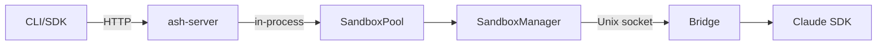

# 10 - Docusaurus Technical Setup

## Package Setup

### Create Docusaurus App

```bash
# In the ash repo root
npx create-docusaurus@latest website classic --typescript

# Or add to pnpm workspace
# pnpm-workspace.yaml: add "website"
```

### Directory Structure

```
ash/
├── packages/          # Existing packages
├── docs/              # Existing docs (source material)
└── website/           # NEW: Docusaurus site
    ├── docs/          # Docusaurus content (structured from plan)
    ├── src/
    │   ├── pages/     # Landing page, custom pages
    │   └── css/       # Custom styles
    ├── static/
    │   ├── img/       # Logo, diagrams
    │   └── openapi.json  # Generated OpenAPI spec
    ├── docusaurus.config.ts
    ├── sidebars.ts
    └── package.json
```

## Configuration

### `docusaurus.config.ts`

```typescript
import type { Config } from '@docusaurus/types';

const config: Config = {
  title: 'Ash',
  tagline: 'Deploy and orchestrate AI agents',
  url: 'https://ash.dev',
  baseUrl: '/',
  organizationName: 'ash-ai-org',
  projectName: 'ash',

  presets: [
    ['classic', {
      docs: {
        sidebarPath: './sidebars.ts',
        editUrl: 'https://github.com/ash-ai-org/ash/tree/main/website/',
      },
      theme: {
        customCss: './src/css/custom.css',
      },
    }],
  ],

  themeConfig: {
    navbar: {
      title: 'Ash',
      items: [
        { type: 'docSidebar', sidebarId: 'docs', label: 'Docs' },
        { href: '/docs/api/overview', label: 'API' },
        { href: 'https://github.com/ash-ai-org/ash', label: 'GitHub', position: 'right' },
      ],
    },
    footer: {
      style: 'dark',
      links: [
        {
          title: 'Docs',
          items: [
            { label: 'Getting Started', to: '/docs/' },
            { label: 'API Reference', to: '/docs/api/overview' },
            { label: 'CLI Reference', to: '/docs/cli/overview' },
          ],
        },
        {
          title: 'Community',
          items: [
            { label: 'GitHub', href: 'https://github.com/ash-ai-org/ash' },
            { label: 'Issues', href: 'https://github.com/ash-ai-org/ash/issues' },
          ],
        },
      ],
    },
    prism: {
      additionalLanguages: ['bash', 'json', 'python', 'yaml'],
    },
  },
};

export default config;
```

### `sidebars.ts`

```typescript
import type { SidebarsConfig } from '@docusaurus/plugin-content-docs';

const sidebars: SidebarsConfig = {
  docs: [
    'introduction',
    {
      type: 'category',
      label: 'Getting Started',
      items: [
        'getting-started/installation',
        'getting-started/quickstart',
        'getting-started/concepts',
      ],
    },
    {
      type: 'category',
      label: 'Guides',
      items: [
        'guides/defining-an-agent',
        'guides/deploying-agents',
        'guides/managing-sessions',
        'guides/streaming-responses',
        'guides/working-with-files',
        'guides/authentication',
        'guides/monitoring',
      ],
    },
    {
      type: 'category',
      label: 'Self-Hosting',
      items: [
        'self-hosting/docker',
        'self-hosting/ec2',
        'self-hosting/gce',
        'self-hosting/configuration',
        'self-hosting/multi-machine',
      ],
    },
    {
      type: 'category',
      label: 'API Reference',
      items: [
        'api/overview',
        'api/agents',
        'api/sessions',
        'api/messages',
        'api/files',
        'api/health',
      ],
    },
    {
      type: 'category',
      label: 'SDKs',
      items: [
        'sdks/typescript',
        'sdks/python',
        'sdks/curl',
      ],
    },
    {
      type: 'category',
      label: 'CLI Reference',
      items: [
        'cli/overview',
        'cli/lifecycle',
        'cli/agents',
        'cli/sessions',
        'cli/health',
      ],
    },
    {
      type: 'category',
      label: 'Architecture',
      items: [
        'architecture/overview',
        'architecture/sandbox-isolation',
        'architecture/bridge-protocol',
        'architecture/session-lifecycle',
        'architecture/sandbox-pool',
        'architecture/sse-backpressure',
        'architecture/database',
        'architecture/decisions',
      ],
    },
    {
      type: 'category',
      label: 'Contributing',
      items: [
        'contributing/development-setup',
        'contributing/project-structure',
        'contributing/testing',
        'contributing/releases',
      ],
    },
  ],
};

export default sidebars;
```

## Plugins

### Search

```bash
# Option A: Local search (no external service)
npm install @easyops-cn/docusaurus-search-local

# Option B: Algolia DocSearch (free for open-source)
# Apply at https://docsearch.algolia.com/
```

### OpenAPI Docs (Optional)

```bash
npm install docusaurus-plugin-openapi-docs docusaurus-theme-openapi-docs
```

Generates interactive API docs from `openapi.json`. Useful but heavy — start without it, add later if hand-written API docs feel insufficient.

## Build & Deploy

### Commands

```bash
cd website
npm install
npm run start    # Dev server at localhost:3000
npm run build    # Production build to build/
npm run serve    # Serve production build locally
```

### Add to Root package.json

```json
{
  "scripts": {
    "docs:dev": "pnpm --filter website start",
    "docs:build": "pnpm --filter website build"
  }
}
```

### Deployment Options

1. **GitHub Pages** (free, simple):
   ```yaml
   # .github/workflows/docs.yml
   - uses: actions/deploy-pages@v4
   ```

2. **Vercel** (preview deploys per PR):
   - Connect repo, set root to `website/`

3. **Cloudflare Pages** (fast, free):
   - Build command: `cd website && npm run build`
   - Output directory: `website/build`

## Content Migration Checklist

Existing docs to migrate into Docusaurus structure:

| Source | Destination | Action |
|--------|-------------|--------|
| `docs/getting-started.md` | `website/docs/getting-started/` | Split into installation + quickstart |
| `docs/architecture.md` | `website/docs/architecture/overview.md` | Migrate, expand |
| `docs/cli-reference.md` | `website/docs/cli/` | Split by command group |
| `docs/api-reference.md` | `website/docs/api/` | Split by resource, add SSE details |
| `docs/features/*.md` | `website/docs/architecture/` + `guides/` | Split: user-facing -> guides, internals -> architecture |
| `docs/decisions/*.md` | `website/docs/architecture/decisions.md` | Consolidate or link |
| `docs/guides/connecting.md` | `website/docs/sdks/curl.md` | Migrate |
| `docs/guides/ec2-deployment.md` | `website/docs/self-hosting/ec2.md` | Migrate |
| `docs/guides/gce-deployment.md` | `website/docs/self-hosting/gce.md` | Migrate |
| `README.md` | `website/docs/introduction.md` | Adapt for docs context |
| `CONTRIBUTING.md` | `website/docs/contributing/` | Split into setup + testing + releases |

## Diagrams

Use Mermaid (built into Docusaurus) for architecture diagrams:



No external diagram tools needed. Keep diagrams in markdown.

## Timeline Estimate

| Phase | Work | Pages |
|-------|------|-------|
| **Phase 1: Foundation** | Docusaurus setup, landing page, Getting Started (4 pages), sidebar | 5 |
| **Phase 2: Guides** | Migrate and expand guides (7 pages) | 7 |
| **Phase 3: Reference** | API reference (6 pages), CLI reference (5 pages), SDK docs (3 pages) | 14 |
| **Phase 4: Deep Docs** | Architecture (8 pages), Self-Hosting (5 pages), Contributing (4 pages) | 17 |
| **Phase 5: Polish** | Search, OpenAPI plugin, diagram cleanup, cross-links, landing page design | - |

Total: ~43 pages. Phase 1-2 gets a useful site live. Phase 3-4 makes it comprehensive.
