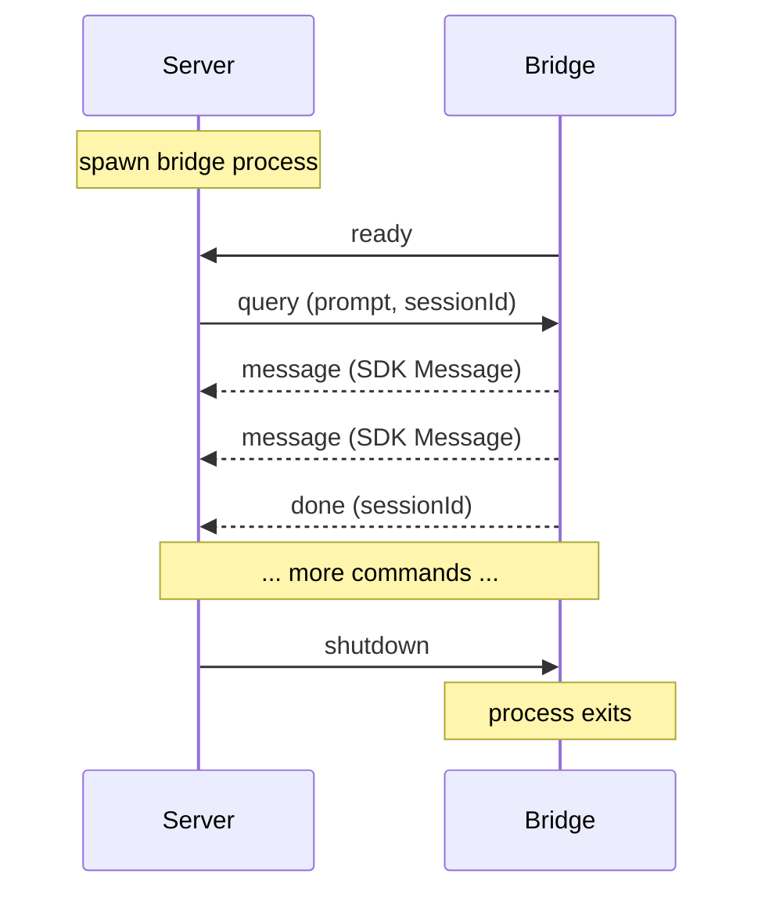

# Bridge Protocol

The bridge process runs inside each sandbox and communicates with the host server over a Unix domain socket using newline-delimited JSON.

## Why Unix Sockets

- Lower overhead than TCP (no network stack, no port allocation)
- No port conflicts when running multiple sandboxes
- Natural 1:1 mapping between socket file and sandbox process
- Socket paths include the sandbox ID for easy identification

Socket path format: `/tmp/ash-<short-id>.sock`

## Wire Format

Each message is a single JSON object followed by a newline character (`\n`). Both directions use the same encoding:

```typescript
function encode(msg: BridgeCommand | BridgeEvent): string {
  return JSON.stringify(msg) + '\n';
}

function decode(line: string): BridgeCommand | BridgeEvent {
  return JSON.parse(line.trim());
}
```

These functions are exported from `@ash-ai/shared` as `encode` and `decode`.

## Commands (Server to Bridge)

Commands are sent from the server (or runner) to the bridge process inside the sandbox.

| Command | Fields | Description |
|---------|--------|-------------|
| `query` | `cmd`, `prompt`, `sessionId`, `includePartialMessages?` | Send a message to the agent. The bridge calls the Claude Code SDK and streams responses back. |
| `resume` | `cmd`, `sessionId` | Resume a conversation with the SDK's session resume capability. |
| `interrupt` | `cmd` | Interrupt the current agent turn. |
| `shutdown` | `cmd` | Gracefully shut down the bridge process. |

### Command type definitions

```typescript
interface QueryCommand {
  cmd: 'query';
  prompt: string;
  sessionId: string;
  includePartialMessages?: boolean;
}

interface ResumeCommand {
  cmd: 'resume';
  sessionId: string;
}

interface InterruptCommand {
  cmd: 'interrupt';
}

interface ShutdownCommand {
  cmd: 'shutdown';
}
```

## Events (Bridge to Server)

Events are sent from the bridge process back to the server.

| Event | Fields | Description |
|-------|--------|-------------|
| `ready` | `ev` | Bridge is initialized and ready to accept commands. Sent once on startup. |
| `message` | `ev`, `data` | A raw SDK `Message` object. The `data` field contains the unmodified message from `@anthropic-ai/claude-code`. |
| `error` | `ev`, `error` | An error occurred during processing. |
| `done` | `ev`, `sessionId` | The agent's turn is complete. |

### Event type definitions

```typescript
interface ReadyEvent {
  ev: 'ready';
}

interface MessageEvent {
  ev: 'message';
  data: unknown; // Raw SDK Message -- passthrough, not translated
}

interface ErrorEvent {
  ev: 'error';
  error: string;
}

interface DoneEvent {
  ev: 'done';
  sessionId: string;
}
```

## SDK Message Passthrough

The `message` event's `data` field contains the raw SDK `Message` object exactly as returned by `@anthropic-ai/claude-code`. Ash does not translate, wrap, or modify these messages.

This is a deliberate design decision ([ADR 0001](/docs/architecture/decisions#adr-0001-sdk-passthrough-types)). The benefits:

- One type system instead of three (no bridge-specific or SSE-specific message types)
- SDK changes propagate automatically through the entire pipeline
- Clients can use SDK types directly for type-safe message handling
- Less code to maintain

The `data.type` field indicates the SDK message kind: `assistant`, `user`, `result`, `stream_event`, etc.

## Connection Lifecycle



The bridge sends `ready` immediately after initializing the Unix socket listener. The server waits for this event before sending any commands (with a 10-second timeout).
