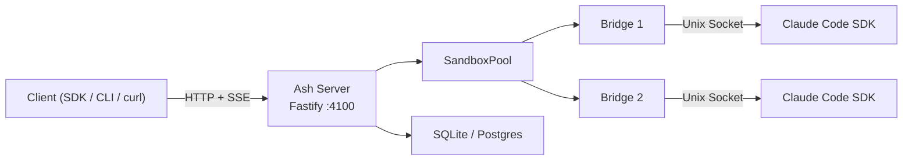
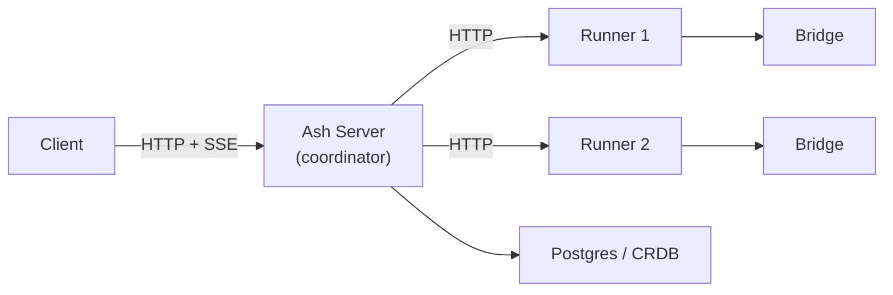
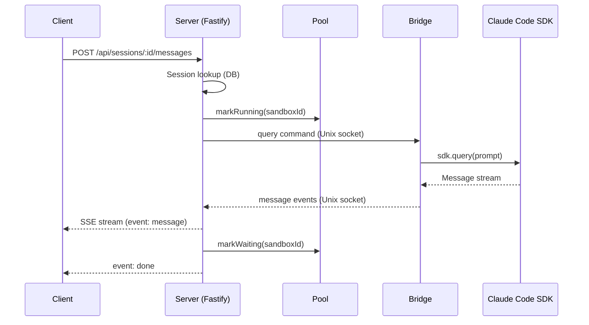
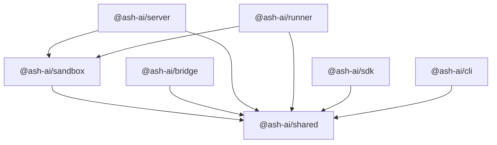

# System Overview

Ash is a thin orchestration layer around the [Claude Code SDK](https://github.com/anthropic-ai/claude-code-sdk-python). It manages agent deployment, session lifecycle, sandbox isolation, and streaming -- adding as little overhead as possible on top of the SDK itself.

## Standalone Mode

In standalone mode, a single server process manages everything: HTTP API, sandbox pool, and bridge processes.



## Coordinator Mode

In coordinator mode, the server acts as a pure control plane. Sandbox execution is offloaded to remote runner processes on separate machines.



Runners register with the server via heartbeat. The server routes sessions to the runner with the most available capacity.

## Components

| Package | Description |
|---------|-------------|
| `@ash-ai/shared` | Types, protocol definitions, constants. No runtime dependencies. |
| `@ash-ai/sandbox` | SandboxManager, SandboxPool, BridgeClient, resource limits, state persistence. Used by both server and runner. |
| `@ash-ai/bridge` | Runs inside each sandbox process. Receives commands over Unix socket, calls the Claude Code SDK, streams responses back. |
| `@ash-ai/server` | Fastify REST API. Agent registry, session routing, SSE streaming, database access. |
| `@ash-ai/runner` | Worker node for multi-machine deployments. Manages sandboxes on a remote host, registers with the server. |
| `@ash-ai/sdk` | TypeScript client library for the Ash API. |
| `@ash-ai/cli` | `ash` command-line tool. Server lifecycle, agent deployment, session management. |

## Message Hot Path

Every message traverses this path. Ash's goal is to add no more than 1-3ms of overhead on top of the SDK.



## Package Dependency Graph



## Storage Layout

```
data/
  ash.db                      # SQLite database (agents, sessions, sandboxes, messages, events)
  sandboxes/
    <session-id>/
      workspace/              # Agent workspace (CLAUDE.md, files, etc.)
  sessions/
    <session-id>/
      workspace/              # Persisted workspace snapshot (for cold resume)
```

In Postgres/CRDB mode, `ash.db` is replaced by the remote database. The `sandboxes/` and `sessions/` directories remain on the local filesystem.
