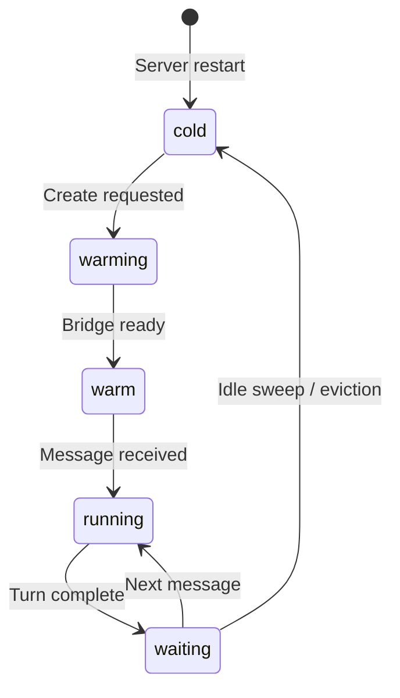

# Sandbox Pool

The `SandboxPool` manages the lifecycle of all sandboxes in a server or runner process. It enforces capacity limits, handles eviction, and runs periodic idle sweeps.

## State Machine

Each sandbox transitions through these states:



## States

| State | Process alive? | Description |
|-------|---------------|-------------|
| `cold` | No | Database record only. Process was evicted or server restarted. Workspace may be persisted for later restore. |
| `warming` | Starting | Sandbox process is being created. Bridge not yet ready. |
| `warm` | Yes | Bridge process is alive and connected. Ready to accept its first command. |
| `waiting` | Yes | Between messages. Sandbox is idle, waiting for the next command. Eligible for idle eviction. |
| `running` | Yes | Actively processing a message. Never evicted. |

## Eviction

When a new sandbox needs to be created but the pool is at capacity (`ASH_MAX_SANDBOXES`), eviction kicks in. Candidates are selected in priority order:

| Tier | State | Action |
|------|-------|--------|
| 1 | `cold` | Delete persisted state and database record. No process to kill. |
| 2 | `warm` | Kill the sandbox process. Delete database record. |
| 3 | `waiting` | Persist workspace state, kill the sandbox process, mark as `cold`. The session is paused so it can be resumed later. |
| 4 | `running` | Never evicted. If all sandboxes are running, the create request returns 503. |

Within each tier, the least-recently-used sandbox is evicted first (ordered by `last_used_at`).

### Eviction query

```sql
SELECT * FROM sandboxes
WHERE state IN ('cold', 'warm', 'waiting')
ORDER BY
  CASE state WHEN 'cold' THEN 0 WHEN 'warm' THEN 1 WHEN 'waiting' THEN 2 END,
  last_used_at ASC
LIMIT 1
```

## Idle Sweep

A periodic timer (every 60 seconds) checks for sandboxes in the `waiting` state that have been idle longer than `ASH_IDLE_TIMEOUT_MS` (default: 30 minutes).

Idle sandboxes are evicted: workspace is persisted, the process is killed, and the database record is marked `cold`. The associated session is paused so it can be resumed later.

```typescript
pool.startIdleSweep();  // Start the periodic timer
pool.stopIdleSweep();   // Stop the timer (graceful shutdown)
```

## Configuration

| Environment Variable | Default | Description |
|---------------------|---------|-------------|
| `ASH_MAX_SANDBOXES` | `1000` | Maximum number of sandbox entries (live + cold) in the database |
| `ASH_IDLE_TIMEOUT_MS` | `1800000` (30 min) | How long a `waiting` sandbox can be idle before eviction |

## Race Condition Safety

`markRunning()` is synchronous (updates the in-memory map immediately). This prevents a race where an idle sweep could evict a sandbox between when a message arrives and when the sandbox starts processing it.

```typescript
// In the message handler -- synchronous, prevents eviction
backend.markRunning(session.sandboxId);
```

The database update is fire-and-forget (asynchronous) since the in-memory map is the source of truth for the running state.

## Server Restart

On server startup, `pool.init()` calls `markAllSandboxesCold()`, which updates all sandbox records in the database to `cold`. This is correct because:

- All sandbox processes were killed when the server stopped
- Cold entries can be evicted or used for workspace restoration during resume
- The in-memory live map starts empty

```typescript
const marked = await this.db.markAllSandboxesCold();
// "Startup: marked 5 stale sandbox(es) as cold"
```

## Pool Stats

The pool exposes statistics for the health endpoint and Prometheus metrics:

```typescript
const stats = await pool.statsAsync();
// {
//   total: 10,       // All entries (live + cold)
//   cold: 3,         // No process
//   warming: 0,      // Starting up
//   warm: 2,         // Ready, no session
//   waiting: 3,      // Idle between messages
//   running: 2,      // Processing a message
//   maxCapacity: 1000,
//   resumeWarmHits: 15,  // Resumes that found sandbox alive
//   resumeColdHits: 5,   // Resumes that needed new sandbox
// }
```
