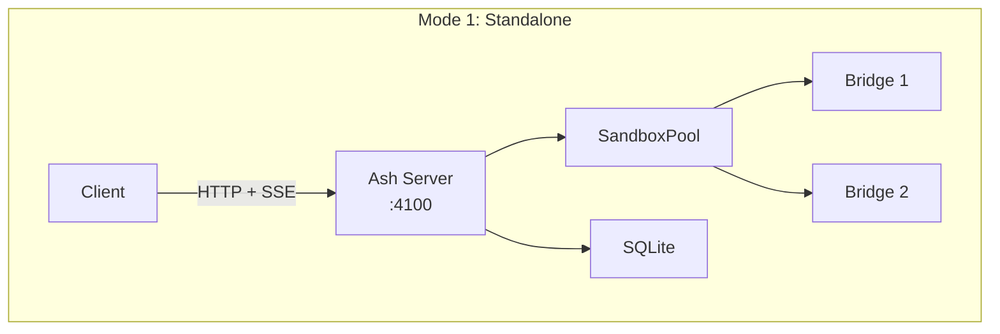
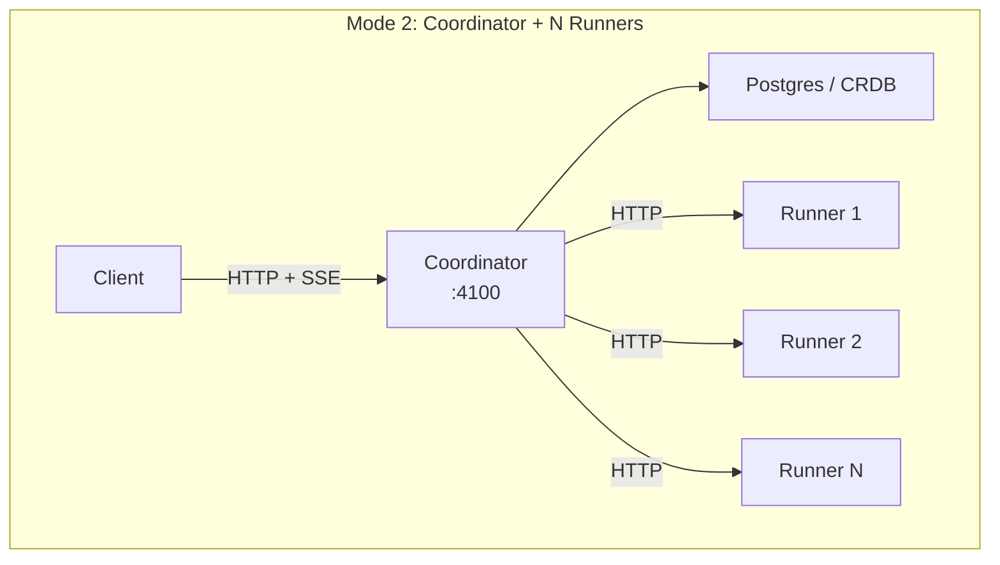
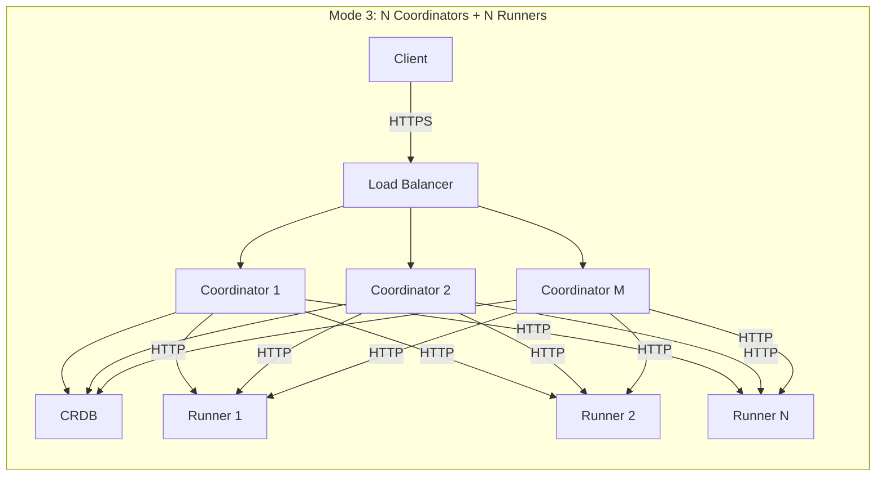
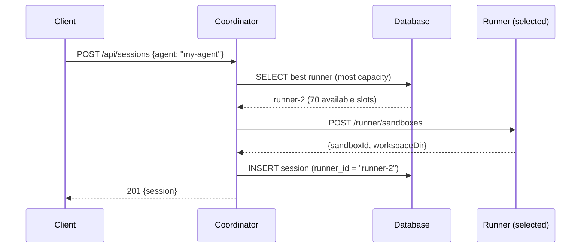
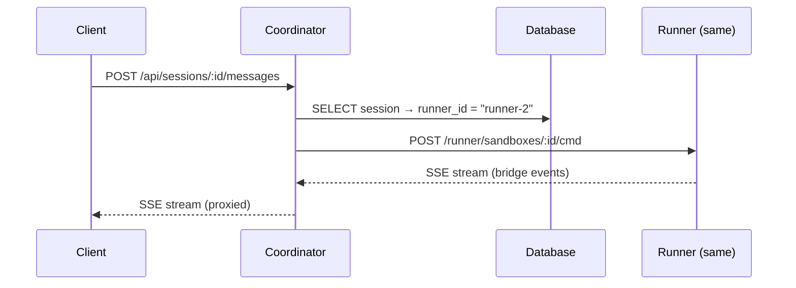
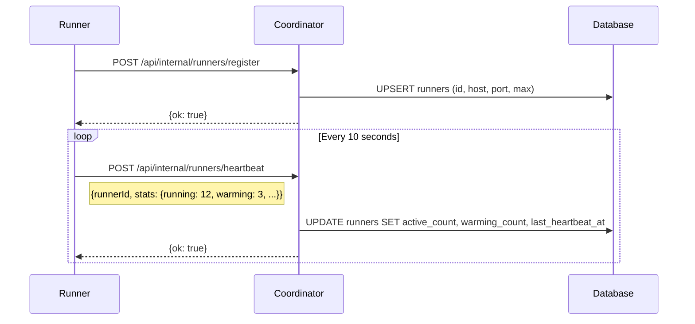
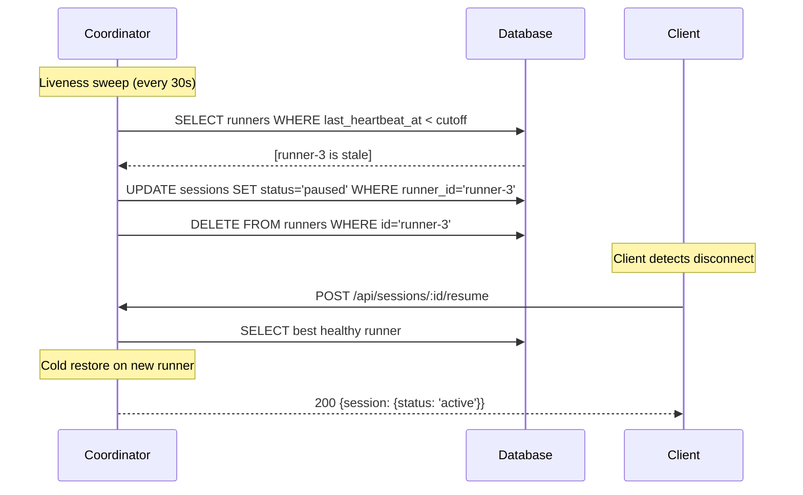
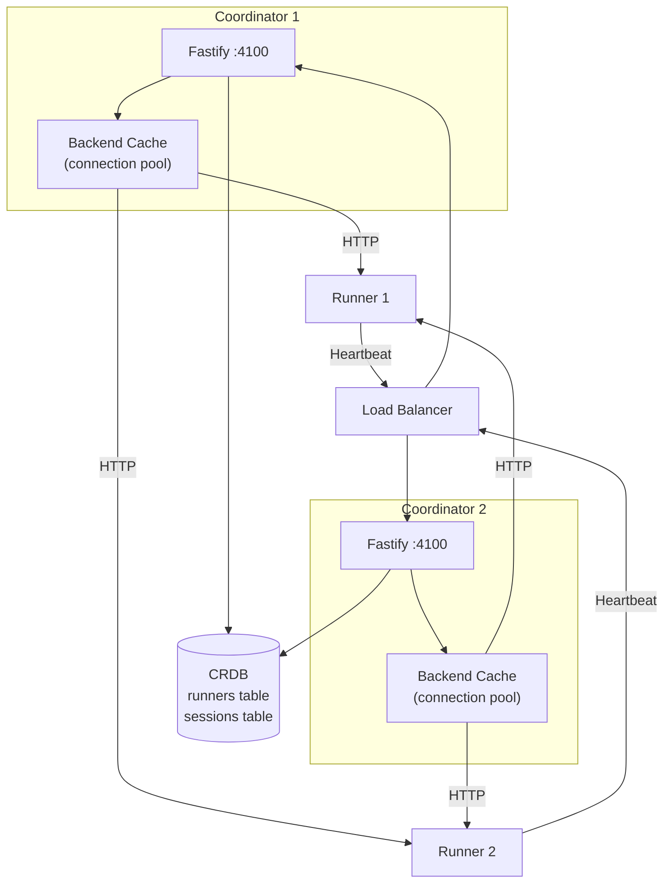
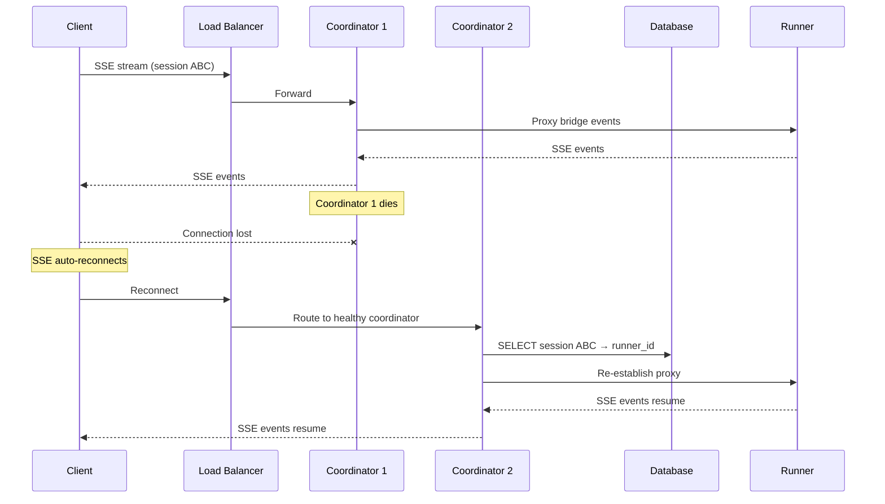
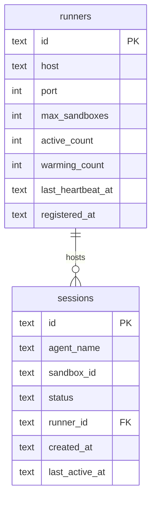

# Scaling Architecture

Ash scales horizontally in two dimensions: the **data plane** (runners that host sandboxes) and the **control plane** (coordinators that route requests). Each dimension scales independently.

## Three Operating Modes

**Start with Mode 1. Move to Mode 2 when one machine isn't enough. Move to Mode 3 when one coordinator isn't enough or you need redundancy.**

## Session Routing

Every session is pinned to a runner. The coordinator selects the runner with the most available capacity at session creation time.

Once assigned, all subsequent messages for that session route to the same runner:

## Runner Registration and Heartbeat

Runners self-register with the control plane and send periodic heartbeats with pool statistics.

## Dead Runner Detection

The coordinator sweeps for dead runners every 30 seconds. If a runner misses its heartbeat window, all its sessions are paused.

## Multi-Coordinator (Mode 3)

In multi-coordinator mode, all coordinators share the same database (Postgres or CockroachDB). The runner registry and session state live in the database — coordinators hold no authoritative state in memory.

**Key properties:**
- Any coordinator can route to any runner (DB is source of truth)
- Coordinators don't talk to each other
- Liveness sweep runs on all coordinators (idempotent)
- SSE reconnection handles coordinator failover (no session migration)

### Coordinator Failover

## Capacity Estimates

| Component | Per Instance | Limit | Bottleneck |
|-----------|-------------|-------|------------|
| Coordinator | ~10,000 SSE connections | Network/CPU | SSE proxy fan-out |
| Runner (8 vCPU, 16GB) | 30-120 sessions | Memory | Depends on sandbox memory limit |
| Database (CRDB) | ~5,000 queries/sec | Single-node CRDB | Session creation path only |

**Scaling math:**
- 3 coordinators = ~30,000 concurrent SSE streams
- 10 runners (256MB/sandbox) = ~600 concurrent sessions
- You'll run out of runner capacity before coordinator capacity

## Database Tables for Scaling

## Environment Variables

### Coordinator

| Variable | Default | Description |
|----------|---------|-------------|
| `ASH_MODE` | `standalone` | Set to `coordinator` for multi-runner mode |
| `ASH_DATABASE_URL` | — | Postgres/CRDB connection string (required for multi-coordinator) |
| `ASH_PORT` | `4100` | HTTP listen port |

### Runner

| Variable | Default | Description |
|----------|---------|-------------|
| `ASH_RUNNER_ID` | `runner-{pid}` | Unique runner identifier |
| `ASH_RUNNER_PORT` | `4200` | HTTP listen port |
| `ASH_SERVER_URL` | — | Coordinator URL for registration |
| `ASH_RUNNER_ADVERTISE_HOST` | — | Host reachable from coordinator |
| `ASH_MAX_SANDBOXES` | `1000` | Maximum concurrent sandboxes |

## When to Scale

| Symptom | Action |
|---------|--------|
| CPU/memory maxed on single machine | Add runners (Mode 2) |
| Need high availability for control plane | Add coordinators (Mode 3) |
| SSE connections saturating coordinator | Add coordinators (Mode 3) |
| Session creation latency increasing | Add runners or increase `ASH_MAX_SANDBOXES` |
| All runners at capacity | Add more runner nodes |

:::tip Measure First
Don't scale until you have numbers. A single standalone Ash server handles dozens of concurrent sessions. Use `ASH_DEBUG_TIMING=1` and the `/metrics` endpoint to find the actual bottleneck before adding complexity.
:::
