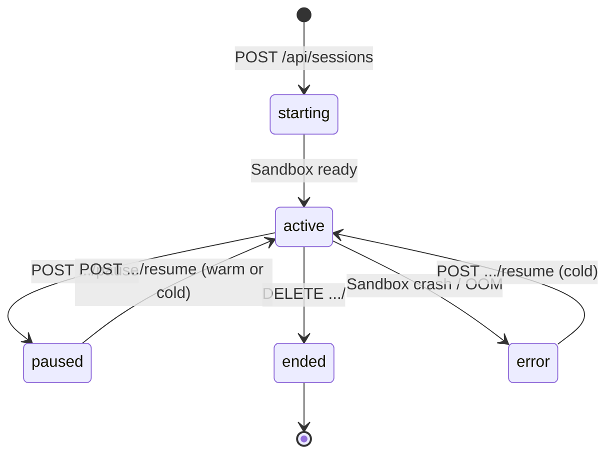
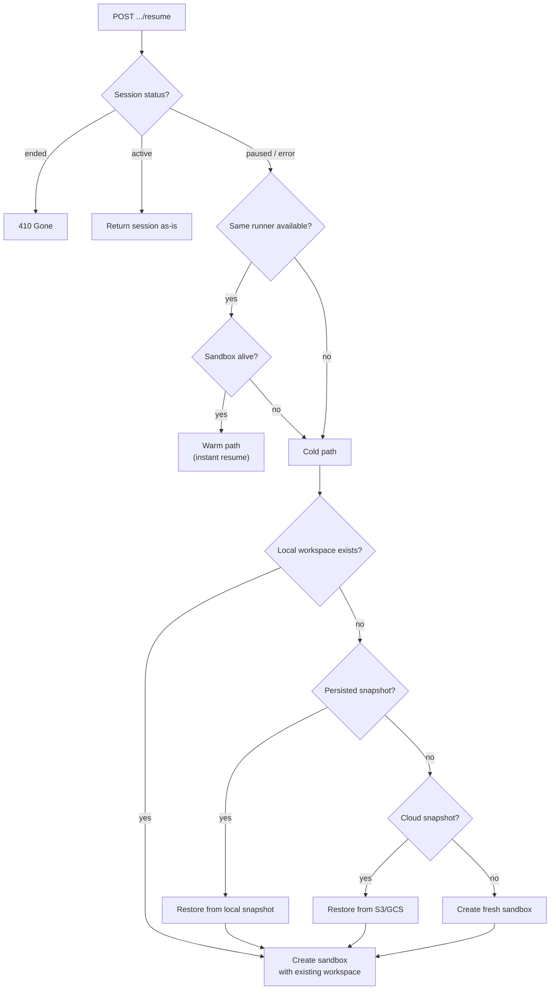

# Session Lifecycle

A session represents an ongoing conversation between a client and an agent running inside a sandbox.

## State Machine

## States

| Status | Description |
|--------|-------------|
| `starting` | Session created, sandbox being allocated. Transient -- transitions to `active` within seconds. |
| `active` | Sandbox is alive and ready to accept messages. |
| `paused` | Session is paused. Workspace state is persisted. The sandbox may still be alive (warm) or evicted (cold). |
| `error` | An error occurred (sandbox crash, OOM kill). Resumable -- a new sandbox will be created on resume. |
| `ended` | Session is permanently ended. The sandbox is destroyed. Cannot be resumed. |

## State Transitions

| Transition | Trigger | What happens |
|-----------|---------|-------------|
| starting -> active | Sandbox process starts, bridge sends `ready` | Session is ready to accept messages |
| active -> paused | `POST /api/sessions/:id/pause` | Workspace state persisted, session marked paused |
| active -> ended | `DELETE /api/sessions/:id` | Workspace persisted, sandbox destroyed, session marked ended |
| active -> error | Sandbox crash or OOM kill | Session marked as error, available for resume |
| paused -> active | `POST /api/sessions/:id/resume` | Warm path (instant) or cold path (new sandbox) |
| error -> active | `POST /api/sessions/:id/resume` | Always cold path (new sandbox created) |

## Pause Flow

When a session is paused:

1. Server persists workspace state to `data/sessions/<id>/workspace/`
2. If cloud storage is configured (`ASH_SNAPSHOT_URL`), workspace is synced to S3/GCS
3. Session status is updated to `paused` in the database
4. The sandbox process remains alive (for potential fast resume)

## Resume Flow

Resume follows a decision tree to minimize latency:

### Warm path

If the original sandbox process is still alive (the session was paused but not evicted), resume is instant. No data is copied, no process is started. The session status is simply updated to `active`.

### Cold path

If the sandbox was evicted or crashed, a new sandbox is created:

1. Check for workspace on local disk (`data/sandboxes/<id>/workspace/`) → **source: local**
2. If not found, check for persisted snapshot (`data/sessions/<id>/workspace/`) → **source: local**
3. If not found, try restoring from cloud storage (`ASH_SNAPSHOT_URL`) → **source: cloud**
4. If no backup exists, create from fresh agent definition → **source: fresh**
5. Create a new sandbox, reusing the restored workspace if available
6. Update session with new sandbox ID and runner ID

The resume source is tracked in metrics (`ash_resume_cold_total{source="..."}`) so you can monitor how often each path is hit. See [State Persistence & Restore](./state-persistence.md) for the full storage architecture.

## Cloud Persistence

When `ASH_SNAPSHOT_URL` is set to an S3 or GCS URL, workspace snapshots are automatically synced to cloud storage after each completed agent turn and before eviction. This enables resume across server restarts and machine migrations.

## Cold Cleanup

Cold sandbox entries (no live process) are automatically cleaned up after 2 hours of inactivity. Local workspace files and database records are deleted, but **cloud snapshots are preserved** — so sessions can still be resumed from cloud storage after local cleanup. See [Sandbox Pool](./sandbox-pool.md#cold-cleanup) for details.
