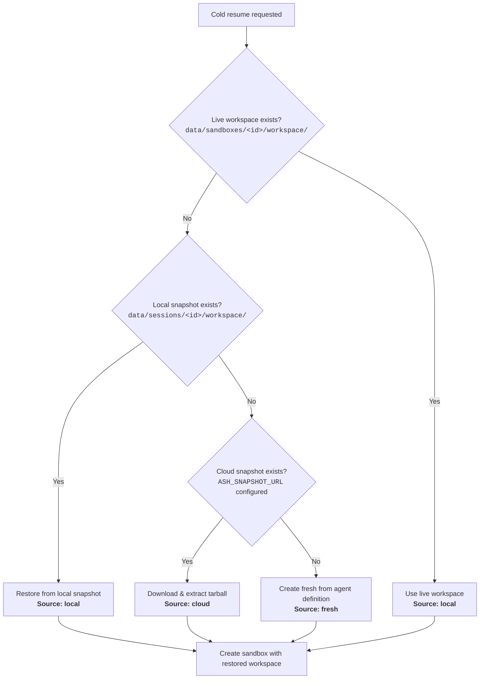
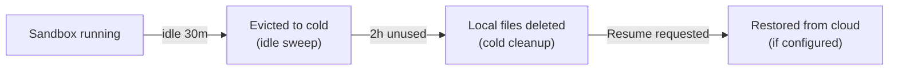

# State Persistence & Restore

Ash persists workspace state so sessions can survive sandbox eviction, server restarts, and even machine migrations. This page documents the storage architecture, the three-layer restore fallback, and the periodic cleanup strategy.

## Storage Layers

Workspace state is stored in up to three locations, each serving a different durability need:

| Layer | Location | Durability | Speed | Purpose |
|-------|----------|-----------|-------|---------|
| **Live workspace** | `data/sandboxes/<sessionId>/workspace/` | Process lifetime | Instant | Active sandbox reads/writes |
| **Local snapshot** | `data/sessions/<sessionId>/workspace/` | Disk lifetime | Fast (local copy) | Survives sandbox eviction and server restart |
| **Cloud snapshot** | `s3://bucket/...` or `gs://bucket/...` | Indefinite | Slow (network) | Survives machine loss, enables cross-runner resume |

### What gets persisted

The **entire workspace directory** is copied — agent source files, `.claude` session state (conversation history, tool results), and any files the agent created during the session. Large reproducible directories (`node_modules`, `.git`, `__pycache__`, `.venv`) are excluded to keep snapshots small and fast.

### When persistence happens

| Event | Local snapshot | Cloud sync |
|-------|---------------|------------|
| Agent turn completes (`done` event) | Yes (synchronous) | Yes (async, fire-and-forget) |
| Session paused via API | Yes | Yes |
| Idle sweep evicts a sandbox | Yes | Yes |
| Capacity eviction (waiting sandbox) | Yes | Yes |
| Session ended via API | Yes | Yes |

Local persistence is synchronous and blocking — the response is not sent until the workspace is safely copied. Cloud sync is asynchronous and best-effort; if it fails, the local copy is still available.

## Restore Fallback Chain

When a session is resumed and the sandbox is gone (cold path), Ash tries to restore the workspace in order:



Each restore source is tracked in metrics so you can monitor how often each path is hit.

## Cold Cleanup

Sandbox entries transition to `cold` when their process is evicted (idle timeout, capacity pressure, or server restart). Cold entries persist on disk and in the database, consuming disk space.

A periodic **cold cleanup sweep** runs every 5 minutes and removes cold sandbox entries that haven't been used for 2 hours:

1. Queries the database for cold sandboxes with `last_used_at` older than the TTL
2. Deletes the live workspace directory (`data/sandboxes/<id>/`)
3. Deletes the local snapshot (`data/sessions/<sessionId>/workspace/`)
4. Deletes the database record

**Cloud snapshots are preserved.** This means a session can still be resumed from cloud storage even after local cleanup. The cloud snapshot acts as the long-term backup.

### Lifecycle timeline



### Configuration

| Constant | Default | Description |
|----------|---------|-------------|
| `COLD_CLEANUP_TTL_MS` | 2 hours | How long a cold sandbox sits before local files are cleaned up |
| `COLD_CLEANUP_INTERVAL_MS` | 5 minutes | How often the cold cleanup sweep runs |
| `DEFAULT_IDLE_TIMEOUT_MS` | 30 minutes | How long a `waiting` sandbox sits before being evicted to cold |

## Cloud Storage Configuration

Set `ASH_SNAPSHOT_URL` to enable cloud-backed persistence:

```bash
# Amazon S3
ASH_SNAPSHOT_URL=s3://my-bucket/ash-snapshots/

# Google Cloud Storage
ASH_SNAPSHOT_URL=gs://my-bucket/ash-snapshots/
```

If not set, only local persistence is used.

### Credentials

Cloud credentials (`AWS_ACCESS_KEY_ID`, `AWS_SECRET_ACCESS_KEY`, `GOOGLE_APPLICATION_CREDENTIALS`) are read by the server process but are **never** passed to sandbox processes. They are excluded from the sandbox environment allowlist.

### Dependencies

- **S3**: `@aws-sdk/client-s3` (included)
- **GCS**: `@google-cloud/storage` (optional peer dependency — install if using GCS)

## Observability

### Metrics

The `/metrics` endpoint exposes resume source breakdown:

```
# Cold resume by workspace source
ash_resume_cold_total{source="local"} 42
ash_resume_cold_total{source="cloud"} 8
ash_resume_cold_total{source="fresh"} 3
```

These are also available in the `/health` response under `pool.resumeColdLocalHits`, `pool.resumeColdCloudHits`, and `pool.resumeColdFreshHits`.

### Log lines

Every resume emits a structured JSON log line to stderr:

```json
{"type":"resume_hit","path":"cold","source":"cloud","sessionId":"abc-123","agentName":"qa-bot","ts":"2026-02-25T10:15:30.000Z"}
```

The `source` field (`local`, `cloud`, or `fresh`) tells you where the workspace came from.

### Useful queries

```promql
# Cloud restore rate (indicates local cleanup is working and cloud is being used)
rate(ash_resume_cold_total{source="cloud"}[5m])

# Fresh start rate (indicates state loss — no backup available)
rate(ash_resume_cold_total{source="fresh"}[5m])

# Ratio of cold resumes that found a backup vs started fresh
(ash_resume_cold_total{source="local"} + ash_resume_cold_total{source="cloud"})
  / ash_resume_cold_total
```

## Multi-Tenant Storage

For multi-tenant deployments, local snapshots are stored under tenant-scoped paths:

| Tenant | Path |
|--------|------|
| `default` | `data/sessions/<sessionId>/workspace/` |
| Other | `data/tenants/<tenantId>/sessions/<sessionId>/workspace/` |

Cloud snapshots are keyed by session ID only (tenant isolation is enforced at the API layer).

## Design Decisions

- **Local-first, cloud-second**: Local copy is synchronous and reliable. Cloud sync is async and additive. If cloud fails, nothing breaks.
- **Full workspace copy, not deltas**: Simpler, more reliable, easier to reason about. The trade-off is higher disk/bandwidth usage for large workspaces.
- **Cloud snapshots survive local cleanup**: Enables long-term resume across machine migrations without unbounded local disk growth.
- **Cold cleanup is separate from idle sweep**: Idle sweep kills live processes (expensive). Cold cleanup removes inert disk files (cheap). Different TTLs make sense — you want to reclaim process resources quickly but can afford to keep disk backups longer.
