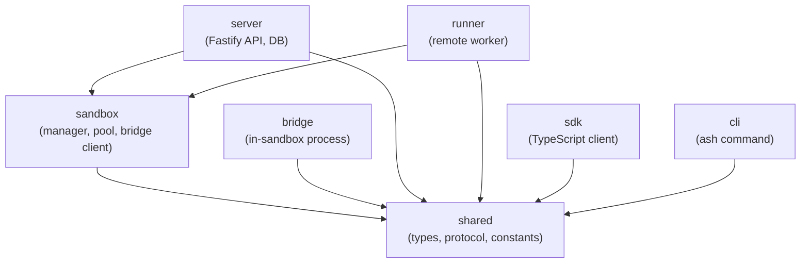

# Project Structure

Ash is a pnpm monorepo with seven packages, each with a specific responsibility.

## Package Map

| Package | npm Name | Description |
|---------|----------|-------------|
| `packages/shared` | `@ash-ai/shared` | Types, protocol definitions, constants. Zero runtime dependencies. Every other package depends on this. |
| `packages/sandbox` | `@ash-ai/sandbox` | `SandboxManager` (process lifecycle), `SandboxPool` (capacity/eviction), `BridgeClient` (Unix socket client), resource limits, state persistence. Used by both server and runner. |
| `packages/bridge` | `@ash-ai/bridge` | Runs inside each sandbox process. Listens on a Unix socket, receives commands, calls the Claude Code SDK (`@anthropic-ai/claude-code`), streams responses back. |
| `packages/server` | `@ash-ai/server` | Fastify REST API. Agent registry, session routing, SSE streaming, database access (SQLite + Postgres). The main entry point. |
| `packages/runner` | `@ash-ai/runner` | Worker node for multi-machine deployments. Manages sandboxes on a remote host. Registers with the server via heartbeat. |
| `packages/sdk` | `@ash-ai/sdk` | TypeScript client library. `AshClient` class, SSE stream parser, re-exported types. |
| `packages/cli` | `@ash-ai/cli` | `ash` command-line tool. Server lifecycle (Docker), agent deployment, session management. |

### Supporting directories

| Directory | Description |
|-----------|-------------|
| `packages/sdk-python` | Python SDK, auto-generated from OpenAPI spec |
| `examples/qa-bot` | Next.js chat app that uses Ash to power a QA bot |
| `examples/hosted-agent` | Minimal example agent definition (CLAUDE.md + config) |
| `examples/python-bot` | Python SDK usage example |
| `docs/` | Architecture docs, ADRs, feature docs, runbooks, benchmarks |
| `test/` | Integration tests and benchmarks (cross-package) |
| `scripts/` | Deployment scripts (EC2, GCE) |

## Dependency Graph



The key insight: `sandbox` is a **library**, not a standalone process. It is imported by both `server` (standalone mode) and `runner` (multi-machine mode).

## Build Order

Packages must be built in dependency order:

1. `shared` (no dependencies)
2. `sandbox` (depends on `shared`)
3. Everything else (`bridge`, `server`, `runner`, `sdk`, `cli` depend on `shared` and/or `sandbox`)

`pnpm build` at the root handles this automatically via workspace dependency resolution.

## Module System

All packages use ESM with TypeScript's `NodeNext` module resolution. Import paths include the `.js` extension:

```typescript
import { encode, decode } from './protocol.js';
import type { Session } from '@ash-ai/shared';
```

## Key Conventions

1. **SDK types pass through.** Ash uses the Claude Code SDK's `Message` type directly throughout the pipeline. Do not create wrapper types for conversation data. See [ADR 0001](/architecture/decisions#adr-0001-sdk-passthrough-types).

2. **Test boundaries, not glue.** Test API contracts, state transitions, protocol serialization, failure modes, and security invariants. Do not test trivial wrappers, type re-exports, or config loading.

3. **Document what you build.** Features go in `docs/features/`, decisions in `docs/decisions/`, benchmarks in `docs/benchmarks/`. If it is not documented, it is not finished.
