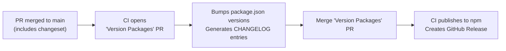

# Release Process

Ash uses [Changesets](https://github.com/changesets/changesets) for versioning, changelogs, and npm publishing.

## Changesets

Every pull request that changes package behavior must include a changeset. A changeset is a small markdown file in `.changeset/` that describes what changed and which packages are affected.

### Creating a Changeset

```bash
pnpm changeset
```

This launches an interactive prompt that asks:

1. Which packages changed?
2. What type of bump for each? (patch, minor, major)
3. A one-sentence summary of the change

The result is a file like `.changeset/cool-dogs-laugh.md`:

```markdown
---
"@ash-ai/server": minor
"@ash-ai/shared": patch
---

Add session events timeline API for tracking agent actions.
```

### Bump Types

| Type | When to use | Examples |
|------|-------------|---------|
| `patch` | Bug fixes, internal refactors, dependency updates | Fix session timeout, update test helpers, bump vitest |
| `minor` | New features, new API endpoints, new CLI commands | Add file listing endpoint, add `ash logs` command |
| `major` | Breaking API changes, removed features, changed wire formats | Remove deprecated endpoint, change SSE event names |

### Rules

- **One changeset per PR.** If a PR does one thing, one changeset. If it does two unrelated things, split the PR.
- **Only include packages that changed.** Check which `packages/*/` directories your diff touches.
- **Description is user-facing.** Write what changed from the consumer's perspective, not implementation details. These become CHANGELOG entries and GitHub Release notes.
- **Internal packages count.** Changes to `@ash-ai/shared`, `@ash-ai/sandbox`, `@ash-ai/bridge` still need changesets. The config automatically bumps their dependents.

### What Does NOT Need a Changeset

- Documentation-only changes
- CI configuration changes
- Test-only changes
- Anything that does not affect published package behavior

## CI Flow



### Step by step

1. **You merge a PR** that includes a `.changeset/*.md` file.
2. **CI automatically opens a "Version Packages" PR.** This PR:
   - Bumps `version` in the affected `package.json` files
   - Generates `CHANGELOG.md` entries from the changeset description
   - Deletes the consumed `.changeset/*.md` files
3. **You review and merge the "Version Packages" PR.**
4. **CI publishes** the bumped packages to npm and creates GitHub Releases with release notes.

### Preview

To see what changesets are pending and what they would do:

```bash
pnpm changeset status
```

### Local Version Bump (rare)

Normally CI handles versioning. If you need to bump locally:

```bash
make version-packages   # Apply pending changesets locally
make publish-dry-run    # See what would be published
make publish            # Publish to npm (requires NPM_TOKEN)
```
