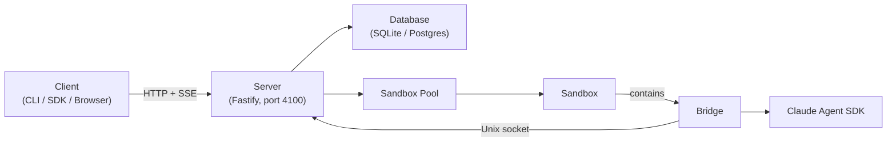
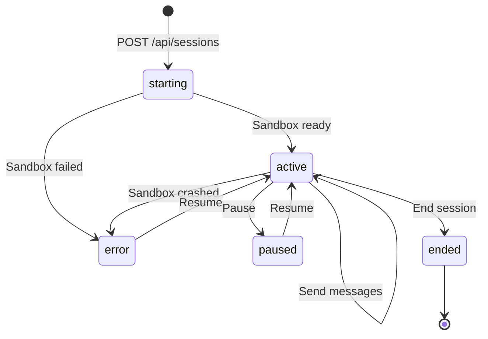

# Key Concepts

Ash has five core concepts. Understanding how they relate to each other will help you make sense of the rest of the documentation.

## The Five Concepts

| Concept | What it is | Analogy |
|---------|-----------|---------|
| **Agent** | A folder containing `CLAUDE.md` (system prompt) and optional config files. Defines the behavior and permissions of an AI agent. | A Docker image -- the blueprint, not the running instance. |
| **Session** | A stateful conversation between a client and a deployed agent. Has a lifecycle (starting, active, paused, ended). Persisted in the database. | A container instance -- created from the image, has state, can be stopped and restarted. |
| **Sandbox** | An isolated child process that runs a single session. Restricted environment variables, resource limits (cgroups on Linux), and filesystem isolation (bubblewrap). | A jail cell -- the agent runs inside it and cannot access anything outside. |
| **Bridge** | A process inside each sandbox that connects to the Claude Agent SDK. Reads the agent's `CLAUDE.md`, receives commands from the server over a Unix socket, and streams responses back. | A translator -- it speaks the server's protocol on one side and the Claude SDK's API on the other. |
| **Server** | The Fastify HTTP server that exposes the REST API, manages the agent registry, routes sessions, and persists state to SQLite or Postgres. | The control tower -- it coordinates everything but does not do the AI work itself. |

## How They Connect



**The data flow for a single message:**

1. The client sends `POST /api/sessions/:id/messages` with a prompt.
2. The server looks up the session and its associated sandbox.
3. The server sends a `query` command to the bridge over the Unix socket.
4. The bridge calls the Claude Agent SDK's `query()` function.
5. The SDK streams response messages back to the bridge.
6. The bridge writes each message to the Unix socket.
7. The server reads each message and writes it as an SSE frame to the HTTP response.
8. The client receives the streamed response.

## Agent Structure

An agent is a folder. The only required file is `CLAUDE.md`:

```
my-agent/
├── CLAUDE.md                    # System prompt (required)
├── .claude/
│   ├── settings.json            # Tool permissions
│   └── skills/
│       └── search-and-summarize/
│           └── SKILL.md         # Reusable skill definition
└── .mcp.json                    # MCP server connections
```

**Minimal agent** -- one file:

```
my-agent/
└── CLAUDE.md
```

**Production agent** -- skills, MCP tools, scoped permissions:

```
research-agent/
├── CLAUDE.md                    # "You are a research assistant..."
├── .mcp.json                    # Connect to web fetch, memory servers
└── .claude/
    ├── settings.json            # Allow: Bash, WebSearch, mcp__fetch
    └── skills/
        ├── search-and-summarize/
        │   └── SKILL.md
        └── write-memo/
            └── SKILL.md
```

## Session Lifecycle

Every session moves through a defined set of states:



### State Descriptions

| State | Description |
|-------|-------------|
| **starting** | Session created, sandbox is being spawned. Brief transient state. |
| **active** | Sandbox is running. The session can send and receive messages. |
| **paused** | Session is paused. The sandbox may still be alive (enabling fast resume) or may have been cleaned up. Workspace state is persisted. |
| **error** | The sandbox crashed or failed to start. The session can be resumed -- Ash will spawn a new sandbox and restore the previous workspace. |
| **ended** | Terminal state. The session was explicitly ended by the client. Cannot be resumed -- create a new session instead. |

### Resume: Fast Path vs. Cold Path

When you resume a paused or errored session, Ash takes one of two paths:

- **Fast path**: The sandbox process is still alive. Ash flips the status back to `active` immediately. This is instant.
- **Cold path**: The sandbox process is gone (crashed, server restarted, idle cleanup). Ash creates a new sandbox in the same workspace directory, restoring the `.claude` session state so the Claude SDK picks up the previous conversation. This takes a few seconds.

In both cases, the conversation history is preserved. The client can continue sending messages as if nothing happened.

## Sandbox Isolation

Each sandbox runs as an isolated child process with multiple layers of protection:

| Layer | Linux | macOS (dev) |
|-------|-------|-------------|
| Process limits | cgroups v2 (pids.max) | -- |
| Memory limits | cgroups v2 (memory.max) | -- |
| CPU limits | cgroups v2 (cpu.max) | -- |
| File size limits | cgroups + tmpfs | ulimit -f |
| Environment | Strict allowlist | Strict allowlist |
| Filesystem | bubblewrap | Restricted cwd |

The environment allowlist ensures only explicitly permitted variables reach the sandbox: `PATH`, `HOME`, `LANG`, `TERM`, `ANTHROPIC_API_KEY`, and a few others. Everything else is blocked. Host credentials like `AWS_ACCESS_KEY_ID` never enter the sandbox.

## Next Steps

- [Quickstart](quickstart.md) -- Deploy your first agent
- [CLI Reference](/cli/overview) -- All commands and flags
- [Architecture](/architecture/overview) -- Deep dive into the system design
