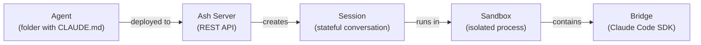

# What is Ash?

Ash is a self-hostable system for deploying and orchestrating AI agents. You define an agent as a folder with a `CLAUDE.md` system prompt, deploy it to a server, and interact with it through a REST API, CLI, or SDKs. Every agent session runs inside an isolated sandbox.

## Who is Ash For?

Ash is for developers and teams who want to run Claude-powered agents in production without giving up control of their infrastructure.

| If you need... | Ash gives you... |
|---|---|
| AI agents behind an API | REST endpoints with SSE streaming |
| Stateful conversations | Sessions that persist, pause, resume, and survive restarts |
| Security isolation | Sandboxes with cgroups, bubblewrap, and environment allowlists |
| Full infrastructure control | Self-hosted on Docker, EC2, ECS, GCE, or bare metal |
| Multi-language clients | TypeScript SDK, Python SDK, CLI, and raw curl |

## Core Concepts at a Glance



- **Agent** -- A folder containing a `CLAUDE.md` system prompt and optional config. Like a Docker image: the blueprint, not the running instance.
- **Session** -- A stateful conversation between a client and a deployed agent. Created, paused, resumed, or ended through the API.
- **Sandbox** -- An isolated child process running a single session. Restricted environment, resource limits, filesystem isolation.
- **Bridge** -- The process inside each sandbox that connects to the Claude Code SDK and streams responses back to the server.
- **Server** -- The Fastify HTTP server that exposes the REST API, manages agents, routes sessions, and persists state.

## Key Differentiators

### Self-Hosted, Not SaaS

Ash runs on your infrastructure. Docker, EC2, ECS Fargate, GCE, or bare metal. Your data stays on your machines. No vendor lock-in, no external API gateway, no third-party dependencies beyond the Claude API itself.

### Agent = Folder

No YAML manifests, no complex deployment pipelines. An agent is a directory with a `CLAUDE.md` file. Add `.claude/settings.json` for permissions, `.mcp.json` for MCP tools, and `.claude/skills/` for reusable workflows. Deploy with `ash deploy ./my-agent`.

### Sessions That Survive

Sessions persist to SQLite or Postgres. They survive server restarts, can be paused and resumed days later, and hand off between machines in a multi-runner setup. Warm resume is 1.7ms (sandbox still alive). Cold resume is 32ms (new process + state restoration).

### Fast by Default

Ash adds sub-millisecond overhead per message (0.41ms p50). Session creation is 44ms. Pool operations are microsecond-scale. The latency users feel is dominated by the LLM API, not Ash. See the [benchmarks](/guides/monitoring) for full numbers.

### Real Isolation

Every session sandbox runs with an environment allowlist (host credentials never leak in), cgroups v2 resource limits on Linux, and bubblewrap filesystem isolation. The agent inside the sandbox is treated as untrusted code.

### Thin Wrapper Philosophy

Ash wraps the Claude Code SDK without reinventing it. SDK types flow through the system unchanged -- from bridge to server to client. Ash adds orchestration (sessions, sandboxes, streaming, persistence) but does not translate or redefine the AI layer.

## Quick Example

```bash
# Install and start the server
npm install -g @ash-ai/cli
ash start

# Define an agent (one file is all you need)
mkdir my-agent
echo "You are a helpful coding assistant." > my-agent/CLAUDE.md

# Deploy and chat
ash deploy ./my-agent --name my-agent
ash chat my-agent "Explain closures in JavaScript"
```

The response streams back in real time. Under the hood, Ash deploys the agent to its registry, spawns an isolated sandbox, starts a bridge process with your `CLAUDE.md` as the system prompt, and proxies the Claude SDK's streaming response as SSE events.

## How Does Ash Compare?

| | Ash | Generic Sandbox APIs | Managed Agent Platforms |
|---|---|---|---|
| **Focus** | AI agent orchestration | Code execution | Agent hosting |
| **Infrastructure** | Self-hosted | Cloud/SaaS | Cloud/SaaS |
| **Session model** | Persistent, resumable | Ephemeral | Varies |
| **Isolation** | OS-level (cgroups, bwrap) | Provider-dependent | Provider-dependent |
| **AI integration** | Deep (Claude Code SDK) | None (BYO) | Framework-specific |
| **Data control** | Full (your machines) | Partial | Limited |

For detailed comparisons, see [Ash vs ComputeSDK](/comparisons/computesdk) and [Ash vs Blaxel](/comparisons/blaxel).

## Next Steps

- **[Installation](/getting-started/installation)** -- Get the CLI installed and the server running
- **[Quickstart](/getting-started/quickstart)** -- Deploy your first agent in two minutes
- **[Key Concepts](/getting-started/concepts)** -- Deep dive into agents, sessions, sandboxes, and bridges
- **[Architecture](/architecture/overview)** -- How all the pieces fit together
