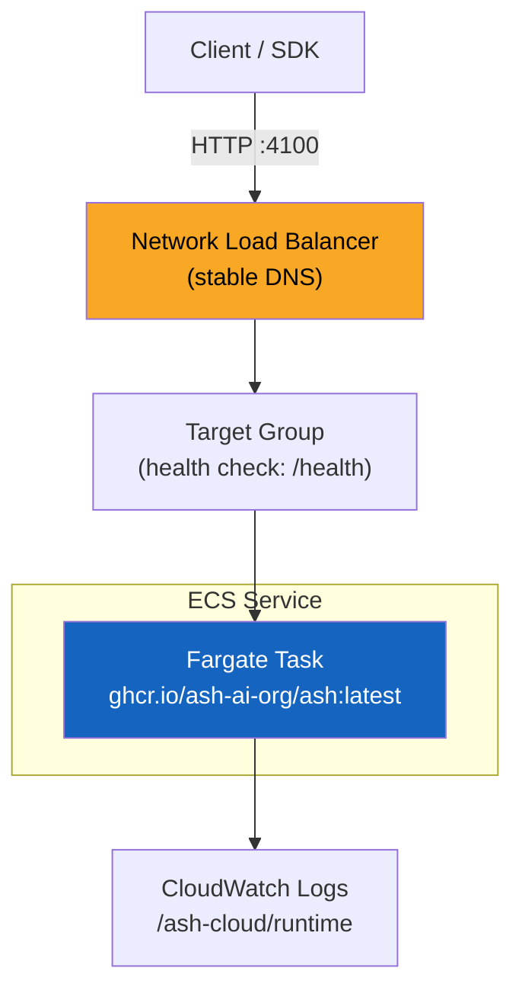

# Deploy to AWS ECS (Fargate)

This guide walks through deploying Ash to AWS ECS on Fargate behind a Network Load Balancer. The result is a production-ready setup with a stable DNS endpoint, API key authentication, and automatic container restarts -- no EC2 instances to manage.

This is a good choice when you want a serverless container deployment with a fixed URL that survives task restarts.

## Prerequisites

- **AWS CLI v2** installed and configured ([install guide](https://docs.aws.amazon.com/cli/latest/userguide/install-cliv2.html))
- **Terraform >= 1.5** installed ([install guide](https://developer.hashicorp.com/terraform/install))
- **ANTHROPIC_API_KEY** for agent execution

## Quick Start

```bash
# Clone the repo
git clone https://github.com/ash-ai-org/ash.git
cd ash

# Create .env from the example
cp .env.example .env
# Edit .env with your credentials (see below)

# Deploy
./scripts/deploy-ecs.sh
```

The script takes 3--5 minutes. When it finishes, it prints the stable NLB URL and a health check command.

## Configuration

Create a `.env` file in the project root with the following variables:

### Required

| Variable | Description |
|----------|-------------|
| `ANTHROPIC_API_KEY` | Your Anthropic API key for agent execution |
| `AWS_ACCESS_KEY_ID` | AWS access key with ECS, EC2, ELB, and IAM permissions |
| `AWS_SECRET_ACCESS_KEY` | AWS secret key |

### Optional

| Variable | Default | Description |
|----------|---------|-------------|
| `AWS_DEFAULT_REGION` | `us-east-1` | AWS region to deploy in |
| `ASH_API_KEY` | (generated) | API key for authenticating requests. Auto-generated if not set. |
| `ASH_INTERNAL_SECRET` | (generated) | Shared secret for coordinator/runner auth. Auto-generated if not set. |
| `ASH_MAX_SANDBOXES` | `20` | Maximum concurrent sandboxes |
| `ASH_ECS_CPU` | `512` | Fargate task CPU (256, 512, 1024, 2048, 4096) |
| `ASH_ECS_MEMORY` | `1024` | Fargate task memory in MB |
| `ASH_ECS_VPC_ID` | (default VPC) | Deploy into a specific VPC |
| `ASH_ECS_SUBNET_IDS` | (default VPC subnets) | Comma-separated list of subnet IDs (need at least 2 for NLB) |

Example `.env`:

```bash
ANTHROPIC_API_KEY=sk-ant-api03-...
AWS_ACCESS_KEY_ID=AKIA...
AWS_SECRET_ACCESS_KEY=...
AWS_DEFAULT_REGION=us-east-1
```

## What the Deploy Script Does

1. **Generates secrets** -- creates `ASH_API_KEY` and `ASH_INTERNAL_SECRET` if not already set in your `.env`.
2. **Detects VPC and subnets** -- uses your default VPC and its subnets, or the ones you specify.
3. **Creates infrastructure via Terraform:**
   - ECS cluster with Container Insights enabled.
   - IAM roles for task execution (image pull, logging) and task (application S3 access).
   - Security group allowing port 4100 inbound and all outbound.
   - CloudWatch log group (`/ash-cloud/runtime`) with 30-day retention.
   - ECS task definition running `ghcr.io/ash-ai-org/ash:latest` on Fargate.
   - ECS service (desired count 1) with automatic restarts.
   - Network Load Balancer (internet-facing) across 2 availability zones.
   - Target group with HTTP health checks on `/health`.
   - TCP listener on port 4100 forwarding to the target group.
4. **Waits for healthy** -- polls the NLB health endpoint until the service is ready.
5. **Prints the connection info** -- NLB URL, health check command, and the API key.

## Architecture



The NLB provides a stable DNS name (`ash-cloud-runtime-nlb-*.elb.<region>.amazonaws.com`) that does not change when the Fargate task restarts. The ECS service ensures exactly one task is always running -- if the container crashes, ECS replaces it automatically.

## Connecting Your Application

After deployment, use the NLB URL as your `ASH_SERVER_URL`:

```bash
export ASH_SERVER_URL=http://<NLB_DNS>:4100
export ASH_API_KEY=<your-api-key>
```

### TypeScript SDK

```typescript
import { AshClient } from "@ash-ai/sdk";

const client = new AshClient({
  serverUrl: "http://<NLB_DNS>:4100",
  apiKey: "<your-api-key>",
});

const session = await client.createSession({ agentName: "my-agent" });
const stream = client.sendMessage(session.id, {
  message: "Hello!",
});

for await (const event of stream) {
  if (event.type === "assistant") {
    process.stdout.write(event.content);
  }
}
```

### curl

```bash
# Health check (no auth required)
curl http://<NLB_DNS>:4100/health | jq .

# List sessions (auth required)
curl http://<NLB_DNS>:4100/api/sessions \
  -H "Authorization: Bearer <your-api-key>" | jq .
```

## Monitoring

### Health Check

```bash
curl http://<NLB_DNS>:4100/health | jq .
```

Returns active session count, sandbox pool stats, uptime, and runner info.

### Logs

```bash
# Stream logs from CloudWatch
aws logs tail /ash-cloud/runtime --follow --region us-east-1

# Or view in the AWS console:
# CloudWatch > Log groups > /ash-cloud/runtime
```

### ECS Service Status

```bash
aws ecs describe-services \
  --cluster ash-cloud \
  --services ash-cloud-runtime \
  --region us-east-1 \
  --query 'services[0].{Status:status,Running:runningCount,Desired:desiredCount}'
```

## Authentication

The deploy script sets `ASH_API_KEY` on the Fargate task. When this variable is set, Ash enforces authentication on all API requests (except `/health` and `/docs`).

Your client must include the key as a Bearer token:

```
Authorization: Bearer <ASH_API_KEY>
```

If you did not provide an `ASH_API_KEY` in your `.env`, the script generated one for you and printed it at the end. You can also retrieve it from the Terraform output:

```bash
cd infra/ecs-fargate
terraform output -raw ash_api_key
```

## Customizing the Terraform

The Terraform files are in `infra/ecs-fargate/`. You can modify them directly for advanced use cases:

| File | Purpose |
|------|---------|
| `main.tf` | Provider, VPC/subnet lookup |
| `ecs.tf` | ECS cluster, task definition, service |
| `nlb.tf` | Load balancer, target group, listener |
| `iam.tf` | IAM roles and policies |
| `security.tf` | Security group and rules |
| `variables.tf` | Input variables |
| `outputs.tf` | Output values (NLB DNS, URL, etc.) |

Common customizations:

```bash
# Change instance size (e.g., for more concurrent sessions)
# Edit variables.tf or pass via terraform.tfvars:
ecs_cpu    = "1024"
ecs_memory = "2048"

# Use a specific VPC
vpc_id     = "vpc-abc123"
subnet_ids = ["subnet-aaa", "subnet-bbb"]
```

After editing, apply changes:

```bash
cd infra/ecs-fargate
terraform plan     # Review
terraform apply    # Apply
```

## Troubleshooting

### "Task stuck in PENDING"

The most common cause is the task cannot reach the internet to pull the container image. Verify:

- If using the **default VPC**: set `assign_public_ip = true` in the ECS service network configuration (this is the default in our Terraform).
- If using a **private VPC**: ensure a NAT gateway is configured so the task can reach `ghcr.io`.

Check the ECS events for details:

```bash
aws ecs describe-services \
  --cluster ash-cloud \
  --services ash-cloud-runtime \
  --region us-east-1 \
  --query 'services[0].events[0:5]'
```

### "Connection refused" on the NLB URL

The NLB can take 1--2 minutes to become fully active after creation. Wait and retry. Also check:

```bash
# Is the target group healthy?
aws elbv2 describe-target-health \
  --target-group-arn $(terraform -chdir=infra/ecs-fargate output -raw target_group_arn) \
  --region us-east-1
```

If targets show `unhealthy`, the task may be crashing. Check CloudWatch logs:

```bash
aws logs tail /ash-cloud/runtime --since 5m --region us-east-1
```

### "401 Unauthorized"

You are hitting an authenticated endpoint without the API key. Add the Authorization header:

```bash
curl -H "Authorization: Bearer <ASH_API_KEY>" http://<NLB_DNS>:4100/api/sessions
```

### Task keeps restarting

Check the container exit reason:

```bash
aws ecs describe-tasks \
  --cluster ash-cloud \
  --tasks $(aws ecs list-tasks --cluster ash-cloud --service-name ash-cloud-runtime --query 'taskArns[0]' --output text) \
  --region us-east-1 \
  --query 'tasks[0].containers[0].{Status:lastStatus,Reason:reason,ExitCode:exitCode}'
```

Common causes:
- Missing `ANTHROPIC_API_KEY` -- the server starts but agents cannot execute.
- Out of memory -- increase `ASH_ECS_MEMORY` (default 1024 MB).

## Tearing Down

```bash
./scripts/teardown-ecs.sh
```

Or manually:

```bash
cd infra/ecs-fargate
terraform destroy -auto-approve
```

This removes the ECS service, task definition, NLB, target group, security group, IAM roles, and log group. Your AWS account is not charged after teardown.

## Scaling Up

For higher concurrency, you can:

1. **Increase task resources** -- set `ASH_ECS_CPU=2048` and `ASH_ECS_MEMORY=4096` for more headroom.
2. **Increase sandbox limit** -- set `ASH_MAX_SANDBOXES=100` (adjust based on available memory).
3. **Switch to multi-machine mode** -- run the Fargate task as a coordinator and add separate runner machines. See [Multi-Machine Setup](./multi-machine.md).

## Cost Estimate

| Resource | Spec | Hourly Cost (us-east-1) |
|----------|------|------------------------|
| Fargate (default) | 0.5 vCPU, 1 GB RAM | ~$0.025 |
| NLB | Per AZ-hour | ~$0.012 |
| NLB data | Per GB processed | ~$0.006/GB |
| CloudWatch Logs | Per GB ingested | ~$0.50/GB |
| **Total (idle)** | | **~$0.037/hour (~$27/month)** |

Fargate pricing scales with CPU and memory. A 2 vCPU / 4 GB task costs ~$0.10/hour (~$73/month). Data transfer costs are additional.
